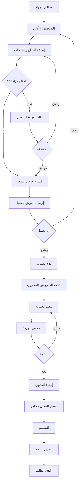

# 🔧 **خطة تطوير موديول الصيانة الشاملة**
## **Repair & Internal Operations Module - Complete Development Plan**

---

## **📅 تاريخ الإعداد: 11 أكتوبر 2025**

<br/>

```
╔════════════════════════════════════════════════════════════════════════╗
║                                                                        ║
║          🎯 خطة تطوير موديول الصيانة + التكامل الشامل              ║
║                                                                        ║
║  🔗 التكامل مع: CRM + Inventory + Finance + Services                 ║
║  📦 قطع الغيار التلقائية + إدارة الخدمات                            ║
║  💰 الفوترة الذكية + تتبع الربحية                                   ║
║  📱 الإشعارات الآلية + تتبع العملاء                                 ║
║                                                                        ║
╚════════════════════════════════════════════════════════════════════════╝
```

---

# 📋 **فهرس المحتويات**

1. [تحليل الوضع الحالي](#1-تحليل-الوضع-الحالي)
2. [الأهداف الرئيسية](#2-الأهداف-الرئيسية)
3. [بنية البيانات المقترحة](#3-بنية-البيانات-المقترحة)
4. [التكامل بين الموديولات](#4-التكامل-بين-الموديولات)
5. [خطة تطوير Backend](#5-خطة-تطوير-backend)
6. [خطة تطوير Frontend](#6-خطة-تطوير-frontend)
7. [نظام الصلاحيات](#7-نظام-الصلاحيات)
8. [دورة العمل الكاملة](#8-دورة-العمل-الكاملة)
9. [خطة الاختبار الشاملة](#9-خطة-الاختبار-الشاملة)
10. [التقارير والتحليلات](#10-التقارير-والتحليلات)
11. [خطة الإطلاق](#11-خطة-الإطلاق)
12. [الخلاصة والتوصيات](#12-الخلاصة-والتوصيات)

---

<br/>

# 🧭 **1. تحليل الوضع الحالي**

## **1.1 الموديولات الموجودة حاليًا**

### ✅ **ما هو موجود:**

```javascript
// Backend APIs
✅ GET    /api/repairs                    // قائمة طلبات الإصلاح
✅ POST   /api/repairs                    // إنشاء طلب إصلاح جديد
✅ GET    /api/repairs/:id                // تفاصيل الطلب
✅ PUT    /api/repairs/:id                // تحديث الطلب
✅ DELETE /api/repairs/:id                // حذف الطلب (soft delete)

✅ GET    /api/parts-used                 // القطع المستخدمة
✅ POST   /api/parts-used                 // تسجيل قطعة مستخدمة
✅ GET    /api/parts-used/reports/consumption

✅ GET    /api/invoices                   // الفواتير
✅ POST   /api/invoices                   // إنشاء فاتورة
✅ GET    /api/invoices/:id               // تفاصيل الفاتورة

✅ Inventory System (40+ endpoints)      // نظام المخزون كامل
✅ CRM System (Customers + Companies)    // نظام إدارة العملاء
✅ Services System                       // نظام الخدمات
```

### ⚠️ **المشاكل والفجوات الحالية:**

#### **1.1.1 مشاكل التكامل:**
```
❌ لا يوجد ربط تلقائي بين طلب الصيانة والمخزون
❌ لا يتم خصم القطع تلقائيًا عند الاستخدام
❌ لا يوجد تحذير عند نقص المخزون أثناء التشخيص
❌ لا يتم إنشاء الفاتورة تلقائيًا عند اكتمال الصيانة
❌ لا يوجد ربط مباشر مع ملف العميل في CRM
```

#### **1.1.2 مشاكل دورة العمل:**
```
❌ لا يوجد نظام موافقات على استخدام القطع الحساسة
❌ لا يتم تسجيل الفني الذي استخدم القطعة
❌ لا يوجد تتبع للرقم التسلسلي للقطع
❌ لا يتم حساب تكلفة الصيانة مقابل الربح تلقائيًا
❌ لا يوجد نظام مرتجعات للقطع
```

#### **1.1.3 مشاكل الإشعارات والتتبع:**
```
❌ لا يوجد نظام إشعارات تلقائي للعميل
❌ لا يتم تحديث حالة العميل في CRM تلقائيًا
❌ لا يوجد تتبع لتاريخ الأجهزة والصيانات السابقة
❌ لا توجد تنبيهات للمدير عند تجاوز التكلفة المتوقعة
```

#### **1.1.4 مشاكل الواجهة:**
```
❌ لا يوجد اختيار مباشر للقطع من المخزون أثناء التشخيص
❌ لا يظهر المخزون المتاح للفني أثناء العمل
❌ لا توجد واجهة لإضافة الخدمات مع القطع في نفس الوقت
❌ لا يوجد عرض للربحية المتوقعة أثناء إعداد العرض
```

---

## **1.2 البنية الحالية لقاعدة البيانات**

### **الجداول الموجودة:**

```sql
-- جدول طلبات الإصلاح
RepairRequest (
  id, customerId, deviceBrand, deviceModel, deviceType,
  serialNumber, devicePassword, issueDescription,
  customerNotes, priority, estimatedCost, actualCost,
  status, assignedTechnicianId, branchId,
  createdAt, updatedAt, deletedAt,
  startedAt, completedAt, deliveredAt
)

-- جدول القطع المستخدمة
PartsUsed (
  id, repairRequestId, inventoryItemId, invoiceItemId,
  quantity, createdAt, updatedAt
)

-- جدول الفواتير
Invoice (
  id, invoiceNumber, repairRequestId, customerId,
  totalAmount, taxAmount, finalAmount, status,
  issueDate, dueDate, currency,
  createdAt, updatedAt, deletedAt
)

-- جدول عناصر الفاتورة
InvoiceItem (
  id, invoiceId, itemType, itemId,
  description, quantity, unitPrice, totalPrice,
  createdAt, updatedAt
)

-- جدول الخدمات
Service (
  id, name, description, basePrice,
  createdAt, updatedAt, deletedAt
)

-- جدول خدمات الصيانة
RepairRequestService (
  id, repairRequestId, serviceId, quantity, price,
  createdAt, updatedAt
)
```

### **ما ينقص في البنية الحالية:**

```sql
❌ لا يوجد جدول لتتبع حالة القطع (معلقة/موافق عليها/مستخدمة/مرتجعة)
❌ لا يوجد تسجيل للفني الذي استخدم القطعة
❌ لا يوجد حقل للرقم التسلسلي للقطع المستخدمة
❌ لا يوجد جدول لطلبات الموافقة على القطع
❌ لا يوجد ربط بين تكلفة القطعة وسعر البيع في الفاتورة
❌ لا يوجد تتبع لتاريخ التعديلات على الطلب
❌ لا يوجد جدول لسجل الإشعارات المرسلة للعميل
```

---

<br/>

# 🎯 **2. الأهداف الرئيسية**

## **2.1 الأهداف الاستراتيجية**

### **🔗 التكامل الكامل**
```
1️⃣ ربط دورة الصيانة بالمخزون تلقائيًا
2️⃣ مزامنة حالة العميل في CRM في كل مرحلة
3️⃣ إنشاء الفواتير تلقائيًا عند الانتهاء
4️⃣ إرسال إشعارات للعميل في كل خطوة
5️⃣ تتبع الربحية والتكلفة في الوقت الفعلي
```

### **📦 إدارة ذكية للقطع والخدمات**
```
1️⃣ اختيار القطع من المخزون أثناء التشخيص
2️⃣ تحذير عند عدم توفر القطع
3️⃣ خصم تلقائي للكميات عند التأكيد
4️⃣ طلب شراء تلقائي عند النقص
5️⃣ دعم مرتجعات القطع والخدمات
```

### **💼 تحسين تجربة المستخدم**
```
1️⃣ واجهة سهلة للفنيين لإضافة القطع والخدمات
2️⃣ عرض المخزون المتاح مباشرة
3️⃣ حساب التكلفة والربح تلقائيًا
4️⃣ تتبع سريع لحالة الطلب
5️⃣ طباعة إيصالات احترافية
```

### **🔒 الأمان والصلاحيات**
```
1️⃣ صلاحيات محددة لكل دور (فني/مدير/محاسب)
2️⃣ موافقات على القطع الحساسة/باهظة الثمن
3️⃣ تسجيل كامل لجميع التعديلات (Audit Log)
4️⃣ منع التلاعب بالأسعار
5️⃣ تتبع المستخدم المسؤول عن كل إجراء
```

---

## **2.2 المخرجات المتوقعة**

### **🎁 للإدارة:**
- ✅ تقارير دقيقة عن التكاليف والأرباح
- ✅ تتبع أداء الفنيين
- ✅ رؤية واضحة لاستهلاك المخزون
- ✅ تنبيهات على القطع الناقصة
- ✅ تحليلات ذكية للقرارات

### **🎁 للفنيين:**
- ✅ واجهة بسيطة لإضافة القطع والخدمات
- ✅ رؤية المخزون المتاح مباشرة
- ✅ تتبع المهام المعلقة
- ✅ طلب القطع الناقصة بسهولة

### **🎁 للعملاء:**
- ✅ إشعارات تلقائية بحالة الجهاز
- ✅ تتبع الطلب أونلاين
- ✅ فواتير واضحة ومفصلة
- ✅ تاريخ كامل للصيانات السابقة

### **🎁 للمحاسبين:**
- ✅ فواتير دقيقة ومفصلة
- ✅ ربط تلقائي بالمدفوعات
- ✅ تقارير مالية شاملة
- ✅ تتبع المستحقات

---

<br/>

# 🗄️ **3. بنية البيانات المقترحة**

## **3.1 التعديلات على الجداول الموجودة**

### **📝 تحديث جدول RepairRequest**

```sql
ALTER TABLE RepairRequest
-- إضافة حقول جديدة للتتبع والتكامل
ADD COLUMN diagnosticNotes TEXT COMMENT 'ملاحظات التشخيص',
ADD COLUMN technicianNotes TEXT COMMENT 'ملاحظات الفني',
ADD COLUMN internalNotes TEXT COMMENT 'ملاحظات داخلية',
ADD COLUMN partsStatus ENUM('none', 'pending', 'approved', 'ordered', 'ready') DEFAULT 'none' COMMENT 'حالة القطع',
ADD COLUMN approvedBy INT NULL COMMENT 'من وافق على القطع',
ADD COLUMN approvedAt DATETIME NULL COMMENT 'تاريخ الموافقة',
ADD COLUMN totalPartsCost DECIMAL(10,2) DEFAULT 0 COMMENT 'تكلفة القطع الإجمالية',
ADD COLUMN totalServicesCost DECIMAL(10,2) DEFAULT 0 COMMENT 'تكلفة الخدمات الإجمالية',
ADD COLUMN totalCost DECIMAL(10,2) DEFAULT 0 COMMENT 'التكلفة الإجمالية',
ADD COLUMN expectedProfit DECIMAL(10,2) DEFAULT 0 COMMENT 'الربح المتوقع',
ADD COLUMN profitMargin DECIMAL(5,2) DEFAULT 0 COMMENT 'هامش الربح %',
ADD COLUMN customerNotified BOOLEAN DEFAULT FALSE COMMENT 'تم إشعار العميل',
ADD COLUMN lastNotificationAt DATETIME NULL COMMENT 'آخر إشعار للعميل',
ADD COLUMN warrantyMonths INT DEFAULT 0 COMMENT 'مدة الضمان بالأشهر',
ADD COLUMN warrantyExpiry DATE NULL COMMENT 'تاريخ انتهاء الضمان',
ADD COLUMN deviceCondition ENUM('excellent', 'good', 'fair', 'poor') COMMENT 'حالة الجهاز عند الاستلام',
ADD COLUMN hasBackup BOOLEAN DEFAULT FALSE COMMENT 'تم عمل نسخة احتياطية',
ADD COLUMN urgency ENUM('normal', 'urgent', 'critical') DEFAULT 'normal' COMMENT 'درجة الاستعجال',
ADD COLUMN estimatedHours DECIMAL(5,2) COMMENT 'الوقت المتوقع بالساعات',
ADD COLUMN actualHours DECIMAL(5,2) COMMENT 'الوقت الفعلي بالساعات',
ADD COLUMN qcStatus ENUM('pending', 'passed', 'failed') COMMENT 'حالة فحص الجودة',
ADD COLUMN qcBy INT NULL COMMENT 'من فحص الجودة',
ADD COLUMN qcAt DATETIME NULL COMMENT 'تاريخ فحص الجودة',
ADD COLUMN qcNotes TEXT COMMENT 'ملاحظات فحص الجودة',

-- Foreign Keys
ADD CONSTRAINT fk_repair_approved_by FOREIGN KEY (approvedBy) REFERENCES User(id),
ADD CONSTRAINT fk_repair_qc_by FOREIGN KEY (qcBy) REFERENCES User(id);

-- Indexes للأداء
CREATE INDEX idx_repair_status ON RepairRequest(status);
CREATE INDEX idx_repair_priority ON RepairRequest(priority);
CREATE INDEX idx_repair_technician ON RepairRequest(assignedTechnicianId);
CREATE INDEX idx_repair_customer ON RepairRequest(customerId);
CREATE INDEX idx_repair_created ON RepairRequest(createdAt);
CREATE INDEX idx_repair_parts_status ON RepairRequest(partsStatus);
```

---

### **📝 تحديث جدول PartsUsed**

```sql
ALTER TABLE PartsUsed
-- إضافة تتبع أفضل للقطع
ADD COLUMN status ENUM('requested', 'approved', 'used', 'returned', 'cancelled') DEFAULT 'requested' COMMENT 'حالة القطعة',
ADD COLUMN requestedBy INT COMMENT 'من طلب القطعة (الفني)',
ADD COLUMN approvedBy INT NULL COMMENT 'من وافق على القطعة',
ADD COLUMN usedBy INT NULL COMMENT 'من استخدم القطعة',
ADD COLUMN requestedAt DATETIME DEFAULT CURRENT_TIMESTAMP COMMENT 'تاريخ الطلب',
ADD COLUMN approvedAt DATETIME NULL COMMENT 'تاريخ الموافقة',
ADD COLUMN usedAt DATETIME NULL COMMENT 'تاريخ الاستخدام الفعلي',
ADD COLUMN returnedAt DATETIME NULL COMMENT 'تاريخ الإرجاع',
ADD COLUMN returnReason TEXT COMMENT 'سبب الإرجاع',
ADD COLUMN serialNumber VARCHAR(100) COMMENT 'الرقم التسلسلي للقطعة المستخدمة',
ADD COLUMN warehouseId INT COMMENT 'المستودع الذي تم السحب منه',
ADD COLUMN unitPurchasePrice DECIMAL(10,2) COMMENT 'سعر الشراء للوحدة',
ADD COLUMN unitSellingPrice DECIMAL(10,2) COMMENT 'سعر البيع للوحدة',
ADD COLUMN totalCost DECIMAL(10,2) COMMENT 'التكلفة الإجمالية',
ADD COLUMN totalPrice DECIMAL(10,2) COMMENT 'السعر الإجمالي',
ADD COLUMN profit DECIMAL(10,2) COMMENT 'الربح',
ADD COLUMN notes TEXT COMMENT 'ملاحظات',
ADD COLUMN isWarranty BOOLEAN DEFAULT FALSE COMMENT 'قطعة تحت الضمان',

-- Foreign Keys
ADD CONSTRAINT fk_parts_requested_by FOREIGN KEY (requestedBy) REFERENCES User(id),
ADD CONSTRAINT fk_parts_approved_by FOREIGN KEY (approvedBy) REFERENCES User(id),
ADD CONSTRAINT fk_parts_used_by FOREIGN KEY (usedBy) REFERENCES User(id),
ADD CONSTRAINT fk_parts_warehouse FOREIGN KEY (warehouseId) REFERENCES Warehouse(id);

-- Indexes
CREATE INDEX idx_parts_repair ON PartsUsed(repairRequestId);
CREATE INDEX idx_parts_item ON PartsUsed(inventoryItemId);
CREATE INDEX idx_parts_status ON PartsUsed(status);
CREATE INDEX idx_parts_requested_by ON PartsUsed(requestedBy);
CREATE INDEX idx_parts_used_at ON PartsUsed(usedAt);
```

---

### **📝 تحديث جدول RepairRequestService**

```sql
ALTER TABLE RepairRequestService
-- إضافة تتبع أفضل للخدمات
ADD COLUMN status ENUM('added', 'in_progress', 'completed', 'cancelled') DEFAULT 'added',
ADD COLUMN performedBy INT COMMENT 'من نفذ الخدمة',
ADD COLUMN startedAt DATETIME NULL COMMENT 'وقت البدء',
ADD COLUMN completedAt DATETIME NULL COMMENT 'وقت الانتهاء',
ADD COLUMN durationMinutes INT COMMENT 'المدة بالدقائق',
ADD COLUMN notes TEXT COMMENT 'ملاحظات على الخدمة',
ADD COLUMN baseCost DECIMAL(10,2) COMMENT 'التكلفة الأساسية',
ADD COLUMN profit DECIMAL(10,2) COMMENT 'الربح من الخدمة',
ADD COLUMN discount DECIMAL(10,2) DEFAULT 0 COMMENT 'الخصم',
ADD COLUMN finalPrice DECIMAL(10,2) COMMENT 'السعر النهائي',
ADD COLUMN isWarranty BOOLEAN DEFAULT FALSE COMMENT 'خدمة تحت الضمان',

-- Foreign Keys
ADD CONSTRAINT fk_service_performed_by FOREIGN KEY (performedBy) REFERENCES User(id);

-- Indexes
CREATE INDEX idx_service_repair ON RepairRequestService(repairRequestId);
CREATE INDEX idx_service_status ON RepairRequestService(status);
CREATE INDEX idx_service_performed_by ON RepairRequestService(performedBy);
```

---

## **3.2 جداول جديدة مطلوبة**

### **📋 جدول RepairWorkflow - سجل دورة العمل**

```sql
CREATE TABLE RepairWorkflow (
    id INT AUTO_INCREMENT PRIMARY KEY,
    repairRequestId INT NOT NULL,
    stage ENUM(
        'received',          -- تم الاستلام
        'initial_diagnosis', -- التشخيص الأولي
        'quote_prepared',    -- تجهيز العرض
        'quote_approved',    -- موافقة العميل
        'parts_ordered',     -- طلب القطع
        'parts_received',    -- استلام القطع
        'repair_started',    -- بدء الصيانة
        'repair_completed',  -- انتهاء الصيانة
        'qc_check',          -- فحص الجودة
        'ready_delivery',    -- جاهز للتسليم
        'delivered',         -- تم التسليم
        'invoice_sent',      -- تم إرسال الفاتورة
        'payment_received'   -- تم استلام الدفعة
    ) NOT NULL,
    status ENUM('pending', 'in_progress', 'completed', 'skipped') DEFAULT 'pending',
    userId INT COMMENT 'المستخدم المسؤول',
    notes TEXT,
    startedAt DATETIME,
    completedAt DATETIME,
    createdAt DATETIME DEFAULT CURRENT_TIMESTAMP,
    updatedAt DATETIME DEFAULT CURRENT_TIMESTAMP ON UPDATE CURRENT_TIMESTAMP,
    
    FOREIGN KEY (repairRequestId) REFERENCES RepairRequest(id) ON DELETE CASCADE,
    FOREIGN KEY (userId) REFERENCES User(id),
    
    INDEX idx_workflow_repair (repairRequestId),
    INDEX idx_workflow_stage (stage),
    INDEX idx_workflow_status (status)
) COMMENT 'سجل مراحل دورة عمل الصيانة';
```

---

### **📋 جدول RepairPartsApproval - موافقات القطع**

```sql
CREATE TABLE RepairPartsApproval (
    id INT AUTO_INCREMENT PRIMARY KEY,
    repairRequestId INT NOT NULL,
    partsUsedId INT NULL COMMENT 'يمكن أن يكون للقطعة أو للطلب كاملاً',
    requestedBy INT NOT NULL COMMENT 'الفني الطالب',
    approverRoleId INT COMMENT 'الدور المطلوب للموافقة',
    approvedBy INT NULL COMMENT 'من وافق',
    status ENUM('pending', 'approved', 'rejected', 'cancelled') DEFAULT 'pending',
    requestReason TEXT COMMENT 'سبب الطلب',
    rejectionReason TEXT COMMENT 'سبب الرفض',
    priority ENUM('low', 'normal', 'high', 'urgent') DEFAULT 'normal',
    totalCost DECIMAL(10,2) COMMENT 'التكلفة الإجمالية للقطع المطلوبة',
    requestedAt DATETIME DEFAULT CURRENT_TIMESTAMP,
    reviewedAt DATETIME NULL,
    createdAt DATETIME DEFAULT CURRENT_TIMESTAMP,
    updatedAt DATETIME DEFAULT CURRENT_TIMESTAMP ON UPDATE CURRENT_TIMESTAMP,
    
    FOREIGN KEY (repairRequestId) REFERENCES RepairRequest(id) ON DELETE CASCADE,
    FOREIGN KEY (partsUsedId) REFERENCES PartsUsed(id) ON DELETE SET NULL,
    FOREIGN KEY (requestedBy) REFERENCES User(id),
    FOREIGN KEY (approvedBy) REFERENCES User(id),
    FOREIGN KEY (approverRoleId) REFERENCES Role(id),
    
    INDEX idx_approval_repair (repairRequestId),
    INDEX idx_approval_status (status),
    INDEX idx_approval_requested_by (requestedBy)
) COMMENT 'طلبات الموافقة على القطع';
```

---

### **📋 جدول RepairNotification - سجل الإشعارات**

```sql
CREATE TABLE RepairNotification (
    id INT AUTO_INCREMENT PRIMARY KEY,
    repairRequestId INT NOT NULL,
    customerId INT NOT NULL,
    notificationType ENUM(
        'repair_received',      -- تم استلام الجهاز
        'diagnosis_complete',   -- اكتمل التشخيص
        'quote_ready',          -- العرض جاهز
        'parts_ordered',        -- تم طلب القطع
        'repair_started',       -- بدأت الصيانة
        'repair_completed',     -- انتهت الصيانة
        'ready_pickup',         -- جاهز للاستلام
        'delivered',            -- تم التسليم
        'invoice_sent',         -- تم إرسال الفاتورة
        'payment_reminder',     -- تذكير بالدفع
        'warranty_expiring'     -- ينتهي الضمان قريبًا
    ) NOT NULL,
    channel ENUM('sms', 'email', 'whatsapp', 'push', 'system') DEFAULT 'system',
    status ENUM('pending', 'sent', 'delivered', 'failed', 'read') DEFAULT 'pending',
    title VARCHAR(255),
    message TEXT NOT NULL,
    recipient VARCHAR(255) COMMENT 'رقم/بريد المستلم',
    sentBy INT COMMENT 'من أرسل الإشعار',
    sentAt DATETIME NULL,
    deliveredAt DATETIME NULL,
    readAt DATETIME NULL,
    failureReason TEXT,
    retryCount INT DEFAULT 0,
    metadata JSON COMMENT 'بيانات إضافية',
    createdAt DATETIME DEFAULT CURRENT_TIMESTAMP,
    
    FOREIGN KEY (repairRequestId) REFERENCES RepairRequest(id) ON DELETE CASCADE,
    FOREIGN KEY (customerId) REFERENCES Customer(id),
    FOREIGN KEY (sentBy) REFERENCES User(id),
    
    INDEX idx_notification_repair (repairRequestId),
    INDEX idx_notification_customer (customerId),
    INDEX idx_notification_type (notificationType),
    INDEX idx_notification_status (status),
    INDEX idx_notification_sent_at (sentAt)
) COMMENT 'سجل إشعارات العملاء';
```

---

### **📋 جدول RepairCostBreakdown - تفصيل التكاليف**

```sql
CREATE TABLE RepairCostBreakdown (
    id INT AUTO_INCREMENT PRIMARY KEY,
    repairRequestId INT NOT NULL,
    itemType ENUM('part', 'service', 'labor', 'shipping', 'other') NOT NULL,
    itemId INT COMMENT 'ID القطعة أو الخدمة',
    description VARCHAR(255) NOT NULL,
    quantity DECIMAL(10,2) DEFAULT 1,
    unitCost DECIMAL(10,2) NOT NULL COMMENT 'سعر التكلفة للوحدة',
    unitPrice DECIMAL(10,2) NOT NULL COMMENT 'سعر البيع للوحدة',
    totalCost DECIMAL(10,2) NOT NULL COMMENT 'التكلفة الإجمالية',
    totalPrice DECIMAL(10,2) NOT NULL COMMENT 'السعر الإجمالي',
    profit DECIMAL(10,2) NOT NULL COMMENT 'الربح',
    profitMargin DECIMAL(5,2) COMMENT 'هامش الربح %',
    discount DECIMAL(10,2) DEFAULT 0,
    finalPrice DECIMAL(10,2) NOT NULL,
    isIncludedInInvoice BOOLEAN DEFAULT TRUE,
    notes TEXT,
    createdAt DATETIME DEFAULT CURRENT_TIMESTAMP,
    updatedAt DATETIME DEFAULT CURRENT_TIMESTAMP ON UPDATE CURRENT_TIMESTAMP,
    
    FOREIGN KEY (repairRequestId) REFERENCES RepairRequest(id) ON DELETE CASCADE,
    
    INDEX idx_cost_repair (repairRequestId),
    INDEX idx_cost_type (itemType)
) COMMENT 'تفصيل التكاليف والأرباح';
```

---

### **📋 جدول RepairDeviceHistory - تاريخ الجهاز**

```sql
CREATE TABLE RepairDeviceHistory (
    id INT AUTO_INCREMENT PRIMARY KEY,
    deviceSerialNumber VARCHAR(100) NOT NULL,
    customerId INT NOT NULL,
    deviceType VARCHAR(100),
    deviceBrand VARCHAR(100),
    deviceModel VARCHAR(100),
    repairRequestId INT COMMENT 'طلب الصيانة المرتبط',
    eventType ENUM(
        'first_repair',      -- أول صيانة
        'repeat_repair',     -- صيانة متكررة
        'warranty_repair',   -- صيانة ضمان
        'part_replaced',     -- استبدال قطعة
        'upgrade',           -- ترقية
        'note'               -- ملاحظة
    ) NOT NULL,
    description TEXT,
    partReplaced VARCHAR(255) COMMENT 'القطعة المستبدلة',
    technicianId INT,
    cost DECIMAL(10,2),
    eventDate DATE NOT NULL,
    createdAt DATETIME DEFAULT CURRENT_TIMESTAMP,
    
    FOREIGN KEY (customerId) REFERENCES Customer(id),
    FOREIGN KEY (repairRequestId) REFERENCES RepairRequest(id) ON DELETE SET NULL,
    FOREIGN KEY (technicianId) REFERENCES User(id),
    
    INDEX idx_history_serial (deviceSerialNumber),
    INDEX idx_history_customer (customerId),
    INDEX idx_history_repair (repairRequestId),
    INDEX idx_history_event_date (eventDate)
) COMMENT 'تاريخ الصيانات للأجهزة';
```

---

### **📋 جدول RepairQuotation - عروض الأسعار**

```sql
CREATE TABLE RepairQuotation (
    id INT AUTO_INCREMENT PRIMARY KEY,
    repairRequestId INT NOT NULL,
    quotationNumber VARCHAR(50) UNIQUE,
    version INT DEFAULT 1 COMMENT 'رقم النسخة من العرض',
    totalPartsCost DECIMAL(10,2) DEFAULT 0,
    totalServicesCost DECIMAL(10,2) DEFAULT 0,
    laborCost DECIMAL(10,2) DEFAULT 0,
    otherCosts DECIMAL(10,2) DEFAULT 0,
    subtotal DECIMAL(10,2) NOT NULL,
    discount DECIMAL(10,2) DEFAULT 0,
    discountType ENUM('fixed', 'percentage') DEFAULT 'fixed',
    taxAmount DECIMAL(10,2) DEFAULT 0,
    taxRate DECIMAL(5,2) DEFAULT 0,
    finalAmount DECIMAL(10,2) NOT NULL,
    validUntil DATE COMMENT 'صلاحية العرض',
    status ENUM('draft', 'sent', 'viewed', 'approved', 'rejected', 'expired') DEFAULT 'draft',
    sentAt DATETIME NULL,
    viewedAt DATETIME NULL,
    respondedAt DATETIME NULL,
    customerResponse TEXT COMMENT 'رد العميل',
    preparedBy INT,
    approvedBy INT NULL COMMENT 'من وافق من الإدارة',
    notes TEXT,
    terms TEXT COMMENT 'الشروط والأحكام',
    createdAt DATETIME DEFAULT CURRENT_TIMESTAMP,
    updatedAt DATETIME DEFAULT CURRENT_TIMESTAMP ON UPDATE CURRENT_TIMESTAMP,
    
    FOREIGN KEY (repairRequestId) REFERENCES RepairRequest(id) ON DELETE CASCADE,
    FOREIGN KEY (preparedBy) REFERENCES User(id),
    FOREIGN KEY (approvedBy) REFERENCES User(id),
    
    INDEX idx_quotation_repair (repairRequestId),
    INDEX idx_quotation_number (quotationNumber),
    INDEX idx_quotation_status (status)
) COMMENT 'عروض أسعار الصيانة';
```

---

### **📋 جدول RepairQualityCheck - فحص الجودة**

```sql
CREATE TABLE RepairQualityCheck (
    id INT AUTO_INCREMENT PRIMARY KEY,
    repairRequestId INT NOT NULL,
    checkedBy INT NOT NULL,
    checklistVersion VARCHAR(20) DEFAULT '1.0',
    overallStatus ENUM('passed', 'failed', 'conditional') NOT NULL,
    functionalityCheck BOOLEAN COMMENT 'فحص الوظائف',
    appearanceCheck BOOLEAN COMMENT 'فحص المظهر',
    partsQualityCheck BOOLEAN COMMENT 'جودة القطع المستخدمة',
    cleanlinessCheck BOOLEAN COMMENT 'النظافة',
    packagingCheck BOOLEAN COMMENT 'التعبئة والتغليف',
    score INT COMMENT 'النقاط (من 100)',
    issues JSON COMMENT 'المشاكل المكتشفة',
    recommendations TEXT COMMENT 'التوصيات',
    requiresRework BOOLEAN DEFAULT FALSE,
    reworkReason TEXT,
    reworkAssignedTo INT NULL,
    reworkCompletedAt DATETIME NULL,
    checkDate DATETIME DEFAULT CURRENT_TIMESTAMP,
    createdAt DATETIME DEFAULT CURRENT_TIMESTAMP,
    updatedAt DATETIME DEFAULT CURRENT_TIMESTAMP ON UPDATE CURRENT_TIMESTAMP,
    
    FOREIGN KEY (repairRequestId) REFERENCES RepairRequest(id) ON DELETE CASCADE,
    FOREIGN KEY (checkedBy) REFERENCES User(id),
    FOREIGN KEY (reworkAssignedTo) REFERENCES User(id),
    
    INDEX idx_qc_repair (repairRequestId),
    INDEX idx_qc_status (overallStatus),
    INDEX idx_qc_checked_by (checkedBy),
    INDEX idx_qc_date (checkDate)
) COMMENT 'سجل فحص الجودة';
```

---

### **📋 جدول RepairTimeLog - سجل الوقت**

```sql
CREATE TABLE RepairTimeLog (
    id INT AUTO_INCREMENT PRIMARY KEY,
    repairRequestId INT NOT NULL,
    technicianId INT NOT NULL,
    activityType ENUM(
        'diagnosis',      -- التشخيص
        'repair',         -- الصيانة
        'testing',        -- الاختبار
        'quality_check',  -- فحص الجودة
        'waiting_parts',  -- انتظار القطع
        'customer_delay', -- تأخير من العميل
        'rework',         -- إعادة عمل
        'other'           -- أخرى
    ) NOT NULL,
    description TEXT,
    startTime DATETIME NOT NULL,
    endTime DATETIME NULL,
    durationMinutes INT COMMENT 'المدة المحسوبة تلقائياً',
    isBillable BOOLEAN DEFAULT TRUE COMMENT 'قابل للفوترة',
    hourlyRate DECIMAL(10,2) COMMENT 'سعر الساعة',
    totalCost DECIMAL(10,2) COMMENT 'التكلفة الإجمالية',
    notes TEXT,
    createdAt DATETIME DEFAULT CURRENT_TIMESTAMP,
    updatedAt DATETIME DEFAULT CURRENT_TIMESTAMP ON UPDATE CURRENT_TIMESTAMP,
    
    FOREIGN KEY (repairRequestId) REFERENCES RepairRequest(id) ON DELETE CASCADE,
    FOREIGN KEY (technicianId) REFERENCES User(id),
    
    INDEX idx_time_repair (repairRequestId),
    INDEX idx_time_technician (technicianId),
    INDEX idx_time_activity (activityType),
    INDEX idx_time_start (startTime)
) COMMENT 'سجل الوقت المستغرق في الصيانة';
```

---

<br/>

# 🔗 **4. التكامل بين الموديولات**

## **4.1 التكامل مع CRM (إدارة العملاء)**

### **🔄 المزامنة التلقائية**

```javascript
// ✅ عند إنشاء طلب صيانة جديد
async function createRepairRequest(data) {
  // 1. إنشاء الطلب
  const repair = await RepairRequest.create(data);
  
  // 2. تحديث ملف العميل في CRM
  await Customer.update(
    {
      lastRepairDate: new Date(),
      totalRepairs: sequelize.literal('totalRepairs + 1'),
      status: 'has_active_repair'
    },
    { where: { id: data.customerId } }
  );
  
  // 3. إضافة ملاحظة في سجل العميل
  await CustomerNote.create({
    customerId: data.customerId,
    type: 'repair_created',
    content: `تم إنشاء طلب صيانة جديد #${repair.id}`,
    linkedEntityType: 'repair',
    linkedEntityId: repair.id
  });
  
  // 4. إرسال إشعار للعميل
  await sendNotification({
    customerId: data.customerId,
    type: 'repair_received',
    repairId: repair.id
  });
  
  return repair;
}
```

### **📊 تحديث الحالة المالية**

```javascript
// ✅ عند تغيير حالة الطلب
async function updateRepairStatus(repairId, newStatus) {
  const repair = await RepairRequest.findByPk(repairId);
  
  // تحديث حالة الطلب
  await repair.update({ status: newStatus });
  
  // تحديث CRM حسب الحالة
  switch(newStatus) {
    case 'completed':
      // إنشاء فاتورة تلقائياً
      const invoice = await createInvoiceFromRepair(repair);
      
      // تحديث الحالة المالية للعميل
      await Customer.update(
        {
          totalSpent: sequelize.literal(`totalSpent + ${repair.totalCost}`),
          lastPurchaseDate: new Date()
        },
        { where: { id: repair.customerId } }
      );
      break;
      
    case 'delivered':
      // تحديث حالة العميل
      await Customer.update(
        { status: 'active' },
        { where: { id: repair.customerId } }
      );
      
      // طلب تقييم
      await sendFeedbackRequest(repair.customerId, repairId);
      break;
  }
  
  // إشعار العميل
  await sendStatusNotification(repair, newStatus);
}
```

---

## **4.2 التكامل مع Inventory (المخزون)**

### **📦 التحقق من توفر القطع**

```javascript
// ✅ عند إضافة قطعة لطلب الصيانة
async function addPartToRepair(repairId, partData) {
  const { inventoryItemId, quantity, warehouseId } = partData;
  
  // 1. التحقق من توفر الكمية
  const stockLevel = await StockLevel.findOne({
    where: { inventoryItemId, warehouseId }
  });
  
  if (!stockLevel || stockLevel.quantity < quantity) {
    // غير متوفر - إنشاء تنبيه
    await StockAlert.create({
      inventoryItemId,
      alertType: 'out_of_stock',
      currentQuantity: stockLevel?.quantity || 0,
      requiredQuantity: quantity,
      linkedEntityType: 'repair_request',
      linkedEntityId: repairId,
      status: 'pending'
    });
    
    // اقتراح طلب شراء
    await suggestPurchaseOrder(inventoryItemId, quantity);
    
    throw new Error('القطعة غير متوفرة في المخزون');
  }
  
  // 2. إنشاء سجل القطعة المطلوبة (حالة: requested)
  const inventoryItem = await InventoryItem.findByPk(inventoryItemId);
  
  const partUsed = await PartsUsed.create({
    repairRequestId: repairId,
    inventoryItemId,
    warehouseId,
    quantity,
    status: 'requested',
    requestedBy: partData.technicianId,
    unitPurchasePrice: inventoryItem.purchasePrice,
    unitSellingPrice: inventoryItem.sellingPrice,
    totalCost: inventoryItem.purchasePrice * quantity,
    totalPrice: inventoryItem.sellingPrice * quantity,
    profit: (inventoryItem.sellingPrice - inventoryItem.purchasePrice) * quantity
  });
  
  // 3. حجز الكمية (Reserved) في المخزون
  await StockMovement.create({
    inventoryItemId,
    warehouseId,
    movementType: 'reserved',
    quantity: -quantity,
    referencable_type: 'RepairRequest',
    referencable_id: repairId,
    notes: `حجز للصيانة #${repairId}`
  });
  
  await stockLevel.update({
    quantity: sequelize.literal(`quantity - ${quantity}`),
    reservedQuantity: sequelize.literal(`reservedQuantity + ${quantity}`)
  });
  
  // 4. تحديث تكلفة الصيانة
  await updateRepairCost(repairId);
  
  return partUsed;
}
```

### **✅ عند تأكيد استخدام القطعة**

```javascript
async function confirmPartUsage(partUsedId) {
  const partUsed = await PartsUsed.findByPk(partUsedId);
  
  // 1. تحديث حالة القطعة إلى "used"
  await partUsed.update({
    status: 'used',
    usedBy: getCurrentUserId(),
    usedAt: new Date()
  });
  
  // 2. خصم نهائي من المخزون
  await StockMovement.create({
    inventoryItemId: partUsed.inventoryItemId,
    warehouseId: partUsed.warehouseId,
    movementType: 'usage',
    quantity: -partUsed.quantity,
    referencable_type: 'PartsUsed',
    referencable_id: partUsedId,
    userId: getCurrentUserId(),
    notes: `استخدام في الصيانة #${partUsed.repairRequestId}`
  });
  
  // 3. تحديث المخزون
  await StockLevel.update(
    {
      reservedQuantity: sequelize.literal(`reservedQuantity - ${partUsed.quantity}`)
    },
    {
      where: {
        inventoryItemId: partUsed.inventoryItemId,
        warehouseId: partUsed.warehouseId
      }
    }
  );
  
  // 4. إضافة إلى breakdown التكاليف
  await RepairCostBreakdown.create({
    repairRequestId: partUsed.repairRequestId,
    itemType: 'part',
    itemId: partUsed.inventoryItemId,
    description: partUsed.description,
    quantity: partUsed.quantity,
    unitCost: partUsed.unitPurchasePrice,
    unitPrice: partUsed.unitSellingPrice,
    totalCost: partUsed.totalCost,
    totalPrice: partUsed.totalPrice,
    profit: partUsed.profit,
    profitMargin: ((partUsed.unitSellingPrice - partUsed.unitPurchasePrice) / partUsed.unitPurchasePrice * 100)
  });
  
  // 5. تحديث التكلفة الإجمالية للصيانة
  await updateRepairCost(partUsed.repairRequestId);
}
```

### **↩️ عند إرجاع قطعة**

```javascript
async function returnPart(partUsedId, returnData) {
  const partUsed = await PartsUsed.findByPk(partUsedId);
  
  if (partUsed.status !== 'used' && partUsed.status !== 'requested') {
    throw new Error('لا يمكن إرجاع هذه القطعة');
  }
  
  // 1. تحديث حالة القطعة
  await partUsed.update({
    status: 'returned',
    returnedAt: new Date(),
    returnReason: returnData.reason
  });
  
  // 2. إرجاع إلى المخزون
  await StockMovement.create({
    inventoryItemId: partUsed.inventoryItemId,
    warehouseId: partUsed.warehouseId,
    movementType: 'return',
    quantity: partUsed.quantity,
    referencable_type: 'PartsUsed',
    referencable_id: partUsedId,
    notes: `إرجاع من الصيانة #${partUsed.repairRequestId}: ${returnData.reason}`
  });
  
  // 3. تحديث المخزون
  const updateField = partUsed.status === 'used' ? 'quantity' : 'reservedQuantity';
  await StockLevel.update(
    {
      [updateField]: sequelize.literal(`${updateField} + ${partUsed.quantity}`)
    },
    {
      where: {
        inventoryItemId: partUsed.inventoryItemId,
        warehouseId: partUsed.warehouseId
      }
    }
  );
  
  // 4. إزالة من التكاليف
  await RepairCostBreakdown.destroy({
    where: {
      repairRequestId: partUsed.repairRequestId,
      itemType: 'part',
      itemId: partUsed.inventoryItemId
    }
  });
  
  // 5. إعادة حساب التكلفة
  await updateRepairCost(partUsed.repairRequestId);
}
```

---

## **4.3 التكامل مع Finance (المالية والفواتير)**

### **💰 إنشاء فاتورة تلقائية**

```javascript
async function createInvoiceFromRepair(repairId) {
  const repair = await RepairRequest.findByPk(repairId, {
    include: [
      { model: PartsUsed, where: { status: 'used' } },
      { model: RepairRequestService, where: { status: 'completed' } },
      { model: Customer }
    ]
  });
  
  // 1. حساب الإجماليات
  const partsTotal = repair.PartsUsed.reduce((sum, p) => sum + parseFloat(p.totalPrice), 0);
  const servicesTotal = repair.RepairRequestServices.reduce((sum, s) => sum + parseFloat(s.finalPrice), 0);
  const subtotal = partsTotal + servicesTotal;
  const taxRate = 0.14; // 14% ضريبة القيمة المضافة
  const taxAmount = subtotal * taxRate;
  const finalAmount = subtotal + taxAmount;
  
  // 2. إنشاء الفاتورة
  const invoice = await Invoice.create({
    invoiceNumber: await generateInvoiceNumber(),
    repairRequestId: repairId,
    customerId: repair.customerId,
    subtotal,
    taxAmount,
    taxRate,
    totalAmount: subtotal,
    finalAmount,
    status: 'draft',
    issueDate: new Date(),
    dueDate: new Date(Date.now() + 30 * 24 * 60 * 60 * 1000), // 30 يوم
    currency: 'EGP',
    terms: 'الدفع خلال 30 يوم من تاريخ الإصدار'
  });
  
  // 3. إضافة عناصر الفاتورة - القطع
  for (const part of repair.PartsUsed) {
    await InvoiceItem.create({
      invoiceId: invoice.id,
      itemType: 'part',
      itemId: part.inventoryItemId,
      description: `قطعة غيار: ${part.description}`,
      quantity: part.quantity,
      unitPrice: part.unitSellingPrice,
      totalPrice: part.totalPrice,
      discount: 0
    });
  }
  
  // 4. إضافة عناصر الفاتورة - الخدمات
  for (const service of repair.RepairRequestServices) {
    await InvoiceItem.create({
      invoiceId: invoice.id,
      itemType: 'service',
      itemId: service.serviceId,
      description: `خدمة: ${service.description}`,
      quantity: service.quantity,
      unitPrice: service.price,
      totalPrice: service.finalPrice,
      discount: service.discount || 0
    });
  }
  
  // 5. تحديث الفاتورة في الصيانة
  await repair.update({ invoiceId: invoice.id });
  
  // 6. إشعار العميل
  await sendNotification({
    customerId: repair.customerId,
    type: 'invoice_sent',
    invoiceId: invoice.id
  });
  
  // 7. تحديث CRM
  await Customer.update(
    {
      totalInvoices: sequelize.literal('totalInvoices + 1'),
      outstandingBalance: sequelize.literal(`outstandingBalance + ${finalAmount}`)
    },
    { where: { id: repair.customerId } }
  );
  
  return invoice;
}
```

---

## **4.4 التكامل مع Services (الخدمات)**

### **🛠️ إضافة خدمة لطلب الصيانة**

```javascript
async function addServiceToRepair(repairId, serviceData) {
  const { serviceId, quantity = 1, performedBy } = serviceData;
  
  // 1. جلب بيانات الخدمة
  const service = await Service.findByPk(serviceId);
  
  if (!service) {
    throw new Error('الخدمة غير موجودة');
  }
  
  // 2. حساب السعر
  const basePrice = parseFloat(service.basePrice);
  const totalPrice = basePrice * quantity;
  
  // 3. إضافة الخدمة للصيانة
  const repairService = await RepairRequestService.create({
    repairRequestId: repairId,
    serviceId,
    quantity,
    price: basePrice,
    finalPrice: totalPrice,
    status: 'added',
    performedBy,
    baseCost: basePrice * 0.3, // تكلفة تقديرية 30% من السعر
    profit: totalPrice - (basePrice * 0.3)
  });
  
  // 4. إضافة إلى breakdown التكاليف
  await RepairCostBreakdown.create({
    repairRequestId: repairId,
    itemType: 'service',
    itemId: serviceId,
    description: service.name,
    quantity,
    unitCost: basePrice * 0.3,
    unitPrice: basePrice,
    totalCost: basePrice * 0.3 * quantity,
    totalPrice: totalPrice,
    profit: (totalPrice - (basePrice * 0.3 * quantity)),
    profitMargin: 70.00
  });
  
  // 5. تحديث التكلفة الإجمالية
  await updateRepairCost(repairId);
  
  return repairService;
}
```

---

## **4.5 التكامل مع Notifications (الإشعارات)**

### **📢 إرسال إشعارات تلقائية**

```javascript
async function sendRepairNotification(repair, notificationType) {
  const customer = await Customer.findByPk(repair.customerId);
  
  // قوالب الإشعارات
  const templates = {
    repair_received: {
      title: 'تم استلام جهازك',
      message: `عزيزي ${customer.name}، تم استلام جهازك ${repair.deviceBrand} ${repair.deviceModel} بنجاح. رقم الطلب: ${repair.id}`,
      channels: ['sms', 'email']
    },
    diagnosis_complete: {
      title: 'اكتمل التشخيص',
      message: `التشخيص: ${repair.diagnosticNotes}. التكلفة المتوقعة: ${repair.estimatedCost} جنيه`,
      channels: ['sms', 'whatsapp']
    },
    repair_completed: {
      title: 'انتهت الصيانة',
      message: `جهازك جاهز للاستلام! يرجى زيارتنا لاستلام جهازك.`,
      channels: ['sms', 'email', 'whatsapp']
    },
    ready_pickup: {
      title: 'جاهز للاستلام',
      message: `جهازك ${repair.deviceBrand} ${repair.deviceModel} جاهز للاستلام من الفرع.`,
      channels: ['sms', 'push']
    }
  };
  
  const template = templates[notificationType];
  
  // إرسال عبر القنوات المختلفة
  for (const channel of template.channels) {
    await RepairNotification.create({
      repairRequestId: repair.id,
      customerId: customer.id,
      notificationType,
      channel,
      title: template.title,
      message: template.message,
      recipient: channel === 'email' ? customer.email : customer.phone,
      sentBy: getCurrentUserId()
    });
    
    // إرسال فعلي (مع خدمة خارجية)
    await sendViaChannel(channel, {
      recipient: channel === 'email' ? customer.email : customer.phone,
      message: template.message
    });
  }
  
  // تحديث حالة الإشعار في الصيانة
  await repair.update({
    customerNotified: true,
    lastNotificationAt: new Date()
  });
}
```

---

## **4.6 نظام الموافقات التلقائي**

```javascript
async function requestPartApproval(repairId, partUsedId, requestedBy) {
  const partUsed = await PartsUsed.findByPk(partUsedId);
  const inventoryItem = await InventoryItem.findByPk(partUsed.inventoryItemId);
  
  // تحديد إذا كانت القطعة تحتاج موافقة
  const needsApproval = 
    inventoryItem.purchasePrice * partUsed.quantity > 500 || // أكثر من 500 جنيه
    inventoryItem.isCritical || // قطعة حساسة
    inventoryItem.category === 'expensive_parts'; // فئة باهظة
  
  if (!needsApproval) {
    // موافقة تلقائية
    await partUsed.update({
      status: 'approved',
      approvedBy: requestedBy,
      approvedAt: new Date()
    });
    return { autoApproved: true };
  }
  
  // إنشاء طلب موافقة
  const approval = await RepairPartsApproval.create({
    repairRequestId: repairId,
    partsUsedId: partUsedId,
    requestedBy,
    approverRoleId: 2, // Branch Manager
    status: 'pending',
    requestReason: `قطعة بسعر ${inventoryItem.purchasePrice * partUsed.quantity} جنيه`,
    totalCost: inventoryItem.purchasePrice * partUsed.quantity,
    priority: inventoryItem.isCritical ? 'urgent' : 'normal'
  });
  
  // إشعار المدير
  await notifyApprover(approval);
  
  return { needsApproval: true, approvalId: approval.id };
}
```

---

<br/>

# 🔧 **5. خطة تطوير Backend**

## **5.1 APIs الجديدة المطلوبة**

### **📋 Repair Workflow APIs**

```javascript
/**
 * ========================================
 * مسار: /api/repair-workflow
 * ========================================
 */

// GET /api/repair-workflow/:repairId
// جلب سجل دورة العمل الكاملة لطلب صيانة
router.get('/:repairId', async (req, res) => {
  const workflow = await RepairWorkflow.findAll({
    where: { repairRequestId: req.params.repairId },
    include: [{ model: User, as: 'user', attributes: ['id', 'name'] }],
    order: [['createdAt', 'ASC']]
  });
  res.json({ success: true, data: workflow });
});

// POST /api/repair-workflow/:repairId/advance
// تقدم إلى المرحلة التالية
router.post('/:repairId/advance', async (req, res) => {
  const { stage, notes } = req.body;
  
  // إنشاء مرحلة جديدة
  const workflow = await RepairWorkflow.create({
    repairRequestId: req.params.repairId,
    stage,
    status: 'in_progress',
    userId: req.user.id,
    notes,
    startedAt: new Date()
  });
  
  // تحديث حالة الصيانة
  await updateRepairFromWorkflow(req.params.repairId, stage);
  
  res.json({ success: true, data: workflow });
});

// PUT /api/repair-workflow/:id/complete
// إتمام مرحلة
router.put('/:id/complete', async (req, res) => {
  const workflow = await RepairWorkflow.findByPk(req.params.id);
  
  await workflow.update({
    status: 'completed',
    completedAt: new Date()
  });
  
  res.json({ success: true, data: workflow });
});
```

---

### **✅ Parts Approval APIs**

```javascript
/**
 * ========================================
 * مسار: /api/parts-approval
 * ========================================
 */

// GET /api/parts-approval
// جلب طلبات الموافقة المعلقة
router.get('/', async (req, res) => {
  const { status = 'pending' } = req.query;
  
  const approvals = await RepairPartsApproval.findAll({
    where: { status },
    include: [
      { model: RepairRequest, attributes: ['id', 'deviceBrand', 'deviceModel'] },
      { model: PartsUsed, include: [InventoryItem] },
      { model: User, as: 'requester', attributes: ['id', 'name'] }
    ],
    order: [['priority', 'DESC'], ['requestedAt', 'DESC']]
  });
  
  res.json({ success: true, data: approvals });
});

// POST /api/parts-approval/:id/approve
// الموافقة على قطعة
router.post('/:id/approve', async (req, res) => {
  const approval = await RepairPartsApproval.findByPk(req.params.id);
  
  await approval.update({
    status: 'approved',
    approvedBy: req.user.id,
    reviewedAt: new Date()
  });
  
  // تحديث حالة القطعة
  if (approval.partsUsedId) {
    await PartsUsed.update(
      { status: 'approved', approvedBy: req.user.id, approvedAt: new Date() },
      { where: { id: approval.partsUsedId } }
    );
  }
  
  // إشعار الفني
  await notifyTechnician(approval.requestedBy, 'part_approved', approval);
  
  res.json({ success: true, message: 'تمت الموافقة بنجاح' });
});

// POST /api/parts-approval/:id/reject
// رفض قطعة
router.post('/:id/reject', async (req, res) => {
  const { rejectionReason } = req.body;
  const approval = await RepairPartsApproval.findByPk(req.params.id);
  
  await approval.update({
    status: 'rejected',
    approvedBy: req.user.id,
    reviewedAt: new Date(),
    rejectionReason
  });
  
  // تحديث حالة القطعة
  if (approval.partsUsedId) {
    await PartsUsed.update(
      { status: 'cancelled' },
      { where: { id: approval.partsUsedId } }
    );
    
    // إرجاع الحجز في المخزون
    await returnReservedStock(approval.partsUsedId);
  }
  
  // إشعار الفني
  await notifyTechnician(approval.requestedBy, 'part_rejected', approval);
  
  res.json({ success: true, message: 'تم الرفض' });
});
```

---

### **📊 Enhanced Repair APIs**

```javascript
/**
 * ========================================
 * مسار: /api/repairs-enhanced
 * ========================================
 */

// GET /api/repairs-enhanced/:id/full
// جلب بيانات كاملة للصيانة مع كل التفاصيل
router.get('/:id/full', async (req, res) => {
  const repair = await RepairRequest.findByPk(req.params.id, {
    include: [
      { model: Customer, include: [Company] },
      { 
        model: PartsUsed, 
        where: { status: { [Op.ne]: 'cancelled' } },
        required: false,
        include: [
          { model: InventoryItem },
          { model: User, as: 'requestedByUser', attributes: ['id', 'name'] },
          { model: User, as: 'approvedByUser', attributes: ['id', 'name'] }
        ]
      },
      { 
        model: RepairRequestService,
        include: [
          { model: Service },
          { model: User, as: 'performer', attributes: ['id', 'name'] }
        ]
      },
      { model: RepairWorkflow, order: [['createdAt', 'ASC']] },
      { model: RepairCostBreakdown },
      { model: RepairQualityCheck },
      { model: Invoice },
      { model: User, as: 'technician', attributes: ['id', 'name'] },
      { model: User, as: 'qcInspector', attributes: ['id', 'name'] }
    ]
  });
  
  if (!repair) {
    return res.status(404).json({ success: false, message: 'الطلب غير موجود' });
  }
  
  res.json({ success: true, data: repair });
});

// POST /api/repairs-enhanced/:id/diagnose
// إضافة تشخيص وقطع/خدمات مقترحة
router.post('/:id/diagnose', async (req, res) => {
  const { diagnosticNotes, estimatedHours, parts, services, urgency } = req.body;
  
  const repair = await RepairRequest.findByPk(req.params.id);
  
  // تحديث التشخيص
  await repair.update({
    diagnosticNotes,
    estimatedHours,
    urgency,
    status: 'diagnosed'
  });
  
  // إضافة القطع المقترحة
  if (parts && parts.length > 0) {
    for (const part of parts) {
      await addPartToRepair(repair.id, {
        ...part,
        technicianId: req.user.id
      });
    }
  }
  
  // إضافة الخدمات المقترحة
  if (services && services.length > 0) {
    for (const service of services) {
      await addServiceToRepair(repair.id, {
        ...service,
        performedBy: req.user.id
      });
    }
  }
  
  // حساب التكلفة المتوقعة
  await updateRepairCost(repair.id);
  
  // إنشاء عرض سعر
  const quotation = await createQuotationFromRepair(repair.id);
  
  // إشعار العميل
  await sendNotification({
    customerId: repair.customerId,
    type: 'diagnosis_complete',
    repairId: repair.id
  });
  
  res.json({ 
    success: true, 
    data: await repair.reload({ 
      include: [PartsUsed, RepairRequestService, RepairCostBreakdown] 
    }),
    quotation
  });
});

// POST /api/repairs-enhanced/:id/start
// بدء الصيانة
router.post('/:id/start', async (req, res) => {
  const repair = await RepairRequest.findByPk(req.params.id);
  
  // التحقق من توفر جميع القطع
  const parts = await PartsUsed.findAll({
    where: { 
      repairRequestId: repair.id,
      status: { [Op.in]: ['requested', 'approved'] }
    }
  });
  
  if (parts.length > 0 && parts.some(p => p.status !== 'approved')) {
    return res.status(400).json({
      success: false,
      message: 'يجب الموافقة على جميع القطع أولاً'
    });
  }
  
  // بدء الصيانة
  await repair.update({
    status: 'in_progress',
    startedAt: new Date()
  });
  
  // إنشاء سجل وقت
  await RepairTimeLog.create({
    repairRequestId: repair.id,
    technicianId: req.user.id,
    activityType: 'repair',
    startTime: new Date()
  });
  
  // workflow
  await RepairWorkflow.create({
    repairRequestId: repair.id,
    stage: 'repair_started',
    status: 'in_progress',
    userId: req.user.id,
    startedAt: new Date()
  });
  
  res.json({ success: true, data: repair });
});

// POST /api/repairs-enhanced/:id/complete
// إنهاء الصيانة
router.post('/:id/complete', async (req, res) => {
  const { technicianNotes, requiresQC = true } = req.body;
  const repair = await RepairRequest.findByPk(req.params.id);
  
  // تحديث الحالة
  await repair.update({
    status: requiresQC ? 'qc_pending' : 'completed',
    completedAt: new Date(),
    technicianNotes
  });
  
  // إنهاء سجل الوقت
  const activeTimeLog = await RepairTimeLog.findOne({
    where: {
      repairRequestId: repair.id,
      technicianId: req.user.id,
      endTime: null
    },
    order: [['startTime', 'DESC']]
  });
  
  if (activeTimeLog) {
    const endTime = new Date();
    const durationMinutes = Math.floor((endTime - activeTimeLog.startTime) / 60000);
    
    await activeTimeLog.update({
      endTime,
      durationMinutes
    });
    
    // تحديث الوقت الفعلي
    await repair.update({ actualHours: durationMinutes / 60 });
  }
  
  // تأكيد استخدام جميع القطع
  await PartsUsed.update(
    { 
      status: 'used',
      usedBy: req.user.id,
      usedAt: new Date()
    },
    { 
      where: { 
        repairRequestId: repair.id,
        status: 'approved'
      }
    }
  );
  
  // خصم نهائي من المخزون
  await finalizeInventoryDeduction(repair.id);
  
  if (requiresQC) {
    // إشعار مسؤول الجودة
    await notifyQCTeam(repair.id);
  } else {
    // إنشاء فاتورة مباشرة
    await createInvoiceFromRepair(repair.id);
    
    // إشعار العميل
    await sendNotification({
      customerId: repair.customerId,
      type: 'repair_completed',
      repairId: repair.id
    });
  }
  
  res.json({ success: true, data: repair });
});

// POST /api/repairs-enhanced/:id/quality-check
// فحص الجودة
router.post('/:id/quality-check', async (req, res) => {
  const { 
    overallStatus, 
    functionalityCheck, 
    appearanceCheck, 
    partsQualityCheck,
    cleanlinessCheck,
    packagingCheck,
    score,
    issues,
    recommendations,
    requiresRework
  } = req.body;
  
  const repair = await RepairRequest.findByPk(req.params.id);
  
  // إنشاء سجل فحص الجودة
  const qc = await RepairQualityCheck.create({
    repairRequestId: repair.id,
    checkedBy: req.user.id,
    overallStatus,
    functionalityCheck,
    appearanceCheck,
    partsQualityCheck,
    cleanlinessCheck,
    packagingCheck,
    score,
    issues,
    recommendations,
    requiresRework
  });
  
  if (requiresRework) {
    // إعادة للفني
    await repair.update({
      status: 'rework_required',
      qcStatus: 'failed',
      qcBy: req.user.id,
      qcAt: new Date(),
      qcNotes: recommendations
    });
    
    // إشعار الفني
    await notifyTechnician(repair.assignedTechnicianId, 'qc_failed', qc);
  } else {
    // نجاح - جاهز للتسليم
    await repair.update({
      status: 'ready_delivery',
      qcStatus: 'passed',
      qcBy: req.user.id,
      qcAt: new Date()
    });
    
    // إنشاء فاتورة
    await createInvoiceFromRepair(repair.id);
    
    // إشعار العميل
    await sendNotification({
      customerId: repair.customerId,
      type: 'ready_pickup',
      repairId: repair.id
    });
  }
  
  res.json({ success: true, data: qc });
});
```

---

### **💰 Quotation APIs**

```javascript
/**
 * ========================================
 * مسار: /api/quotations
 * ========================================
 */

// POST /api/quotations/generate/:repairId
// إنشاء عرض سعر من الصيانة
router.post('/generate/:repairId', async (req, res) => {
  const quotation = await createQuotationFromRepair(req.params.repairId);
  res.json({ success: true, data: quotation });
});

// POST /api/quotations/:id/send
// إرسال العرض للعميل
router.post('/:id/send', async (req, res) => {
  const quotation = await RepairQuotation.findByPk(req.params.id);
  
  await quotation.update({
    status: 'sent',
    sentAt: new Date()
  });
  
  // إرسال للعميل عبر البريد/واتساب
  await sendQuotationToCustomer(quotation);
  
  res.json({ success: true, message: 'تم إرسال العرض للعميل' });
});

// POST /api/quotations/:id/approve
// موافقة العميل على العرض
router.post('/:id/approve', async (req, res) => {
  const { customerResponse } = req.body;
  const quotation = await RepairQuotation.findByPk(req.params.id);
  
  await quotation.update({
    status: 'approved',
    respondedAt: new Date(),
    customerResponse
  });
  
  // تحديث الصيانة
  await RepairRequest.update(
    { 
      status: 'quote_approved',
      partsStatus: 'approved'
    },
    { where: { id: quotation.repairRequestId } }
  );
  
  // الموافقة التلقائية على القطع
  await PartsUsed.update(
    {
      status: 'approved',
      approvedAt: new Date()
    },
    {
      where: { 
        repairRequestId: quotation.repairRequestId,
        status: 'requested'
      }
    }
  );
  
  res.json({ success: true, message: 'تمت الموافقة على العرض' });
});
```

---

### **📊 Cost Analysis APIs**

```javascript
/**
 * ========================================
 * مسار: /api/repair-cost-analysis
 * ========================================
 */

// GET /api/repair-cost-analysis/:repairId
// تحليل تفصيلي للتكاليف والأرباح
router.get('/:repairId', async (req, res) => {
  const breakdown = await RepairCostBreakdown.findAll({
    where: { repairRequestId: req.params.repairId },
    order: [['itemType', 'ASC'], ['createdAt', 'ASC']]
  });
  
  // حساب الإجماليات
  const totals = {
    totalCost: breakdown.reduce((sum, item) => sum + parseFloat(item.totalCost), 0),
    totalPrice: breakdown.reduce((sum, item) => sum + parseFloat(item.totalPrice), 0),
    totalProfit: breakdown.reduce((sum, item) => sum + parseFloat(item.profit), 0),
    totalDiscount: breakdown.reduce((sum, item) => sum + parseFloat(item.discount || 0), 0),
    finalAmount: breakdown.reduce((sum, item) => sum + parseFloat(item.finalPrice), 0)
  };
  
  totals.profitMargin = (totals.totalProfit / totals.totalCost * 100).toFixed(2);
  
  // تقسيم حسب النوع
  const byType = {
    parts: breakdown.filter(b => b.itemType === 'part'),
    services: breakdown.filter(b => b.itemType === 'service'),
    labor: breakdown.filter(b => b.itemType === 'labor'),
    other: breakdown.filter(b => b.itemType === 'other')
  };
  
  res.json({ 
    success: true, 
    data: {
      breakdown,
      totals,
      byType
    }
  });
});

// GET /api/repair-cost-analysis/technician/:technicianId
// تحليل أداء فني (تكاليف وأرباح)
router.get('/technician/:technicianId', async (req, res) => {
  const { startDate, endDate } = req.query;
  
  const repairs = await RepairRequest.findAll({
    where: {
      assignedTechnicianId: req.params.technicianId,
      createdAt: {
        [Op.between]: [startDate || '2025-01-01', endDate || new Date()]
      }
    },
    include: [RepairCostBreakdown]
  });
  
  const analysis = {
    totalRepairs: repairs.length,
    completedRepairs: repairs.filter(r => r.status === 'delivered').length,
    totalRevenue: repairs.reduce((sum, r) => sum + parseFloat(r.totalCost || 0), 0),
    totalProfit: repairs.reduce((sum, r) => sum + parseFloat(r.expectedProfit || 0), 0),
    averageRepairTime: repairs.reduce((sum, r) => sum + parseFloat(r.actualHours || 0), 0) / repairs.length
  };
  
  res.json({ success: true, data: analysis });
});
```

---

### **📱 Notification APIs**

```javascript
/**
 * ========================================
 * مسار: /api/repair-notifications
 * ========================================
 */

// GET /api/repair-notifications/:repairId
// جلب سجل الإشعارات لطلب صيانة
router.get('/:repairId', async (req, res) => {
  const notifications = await RepairNotification.findAll({
    where: { repairRequestId: req.params.repairId },
    order: [['createdAt', 'DESC']]
  });
  
  res.json({ success: true, data: notifications });
});

// POST /api/repair-notifications/:repairId/send
// إرسال إشعار يدوي
router.post('/:repairId/send', async (req, res) => {
  const { type, message, channels } = req.body;
  const repair = await RepairRequest.findByPk(req.params.repairId);
  
  for (const channel of channels) {
    await sendNotification({
      customerId: repair.customerId,
      repairId: repair.id,
      type,
      channel,
      message
    });
  }
  
  res.json({ success: true, message: 'تم إرسال الإشعارات' });
});

// POST /api/repair-notifications/:id/retry
// إعادة محاولة إرسال إشعار فاشل
router.post('/:id/retry', async (req, res) => {
  const notification = await RepairNotification.findByPk(req.params.id);
  
  if (notification.status !== 'failed') {
    return res.status(400).json({ 
      success: false, 
      message: 'الإشعار ليس فاشلاً' 
    });
  }
  
  await retryNotification(notification);
  
  res.json({ success: true, message: 'تمت إعادة الإرسال' });
});
```

---

### **⏱️ Time Tracking APIs**

```javascript
/**
 * ========================================
 * مسار: /api/repair-time
 * ========================================
 */

// POST /api/repair-time/:repairId/start
// بدء تسجيل الوقت
router.post('/:repairId/start', async (req, res) => {
  const { activityType, description } = req.body;
  
  const timeLog = await RepairTimeLog.create({
    repairRequestId: req.params.repairId,
    technicianId: req.user.id,
    activityType,
    description,
    startTime: new Date()
  });
  
  res.json({ success: true, data: timeLog });
});

// POST /api/repair-time/:id/stop
// إيقاف تسجيل الوقت
router.post('/:id/stop', async (req, res) => {
  const timeLog = await RepairTimeLog.findByPk(req.params.id);
  
  const endTime = new Date();
  const durationMinutes = Math.floor((endTime - timeLog.startTime) / 60000);
  
  await timeLog.update({
    endTime,
    durationMinutes,
    totalCost: (durationMinutes / 60) * (timeLog.hourlyRate || 0)
  });
  
  res.json({ success: true, data: timeLog });
});

// GET /api/repair-time/:repairId/summary
// ملخص الوقت المستغرق
router.get('/:repairId/summary', async (req, res) => {
  const timeLogs = await RepairTimeLog.findAll({
    where: { repairRequestId: req.params.repairId },
    include: [{ model: User, as: 'technician', attributes: ['id', 'name'] }]
  });
  
  const summary = {
    totalMinutes: timeLogs.reduce((sum, log) => sum + (log.durationMinutes || 0), 0),
    totalHours: timeLogs.reduce((sum, log) => sum + (log.durationMinutes || 0), 0) / 60,
    billableMinutes: timeLogs.filter(log => log.isBillable).reduce((sum, log) => sum + (log.durationMinutes || 0), 0),
    totalCost: timeLogs.reduce((sum, log) => sum + parseFloat(log.totalCost || 0), 0),
    byActivity: {}
  };
  
  timeLogs.forEach(log => {
    if (!summary.byActivity[log.activityType]) {
      summary.byActivity[log.activityType] = { count: 0, minutes: 0 };
    }
    summary.byActivity[log.activityType].count++;
    summary.byActivity[log.activityType].minutes += log.durationMinutes || 0;
  });
  
  res.json({ success: true, data: { summary, logs: timeLogs } });
});
```

---

### **🔒 Permissions & Audit**

```javascript
/**
 * ========================================
 * Middleware: checkRepairPermission
 * ========================================
 */

const checkRepairPermission = (action) => async (req, res, next) => {
  const userId = req.user.id;
  const userRole = req.user.roleId;
  const repairId = req.params.id || req.params.repairId;
  
  // Admin - كل الصلاحيات
  if (userRole === 1) return next();
  
  const repair = await RepairRequest.findByPk(repairId);
  
  if (!repair) {
    return res.status(404).json({ success: false, message: 'الطلب غير موجود' });
  }
  
  const permissions = {
    // الفني - يمكنه تعديل طلباته فقط
    3: {
      view: repair.assignedTechnicianId === userId || true,
      update: repair.assignedTechnicianId === userId,
      addParts: repair.assignedTechnicianId === userId,
      complete: repair.assignedTechnicianId === userId,
      delete: false,
      approveParts: false,
      modifyPrice: false
    },
    // مدير الفرع - كل شيء ما عدا الحذف
    2: {
      view: true,
      update: true,
      addParts: true,
      complete: true,
      delete: false,
      approveParts: true,
      modifyPrice: true
    },
    // موظف الاستقبال - إضافة فقط
    4: {
      view: true,
      update: false,
      addParts: false,
      complete: false,
      delete: false,
      approveParts: false,
      modifyPrice: false
    }
  };
  
  if (!permissions[userRole] || !permissions[userRole][action]) {
    return res.status(403).json({ 
      success: false, 
      message: 'ليس لديك صلاحية لتنفيذ هذا الإجراء' 
    });
  }
  
  next();
};

/**
 * ========================================
 * Audit Logging
 * ========================================
 */

const auditLog = async (action, entityType, entityId, data) => {
  await AuditLog.create({
    userId: getCurrentUserId(),
    action, // 'create', 'update', 'delete', 'approve', etc.
    entityType, // 'repair', 'part_used', 'invoice', etc.
    entityId,
    oldValues: data.old || null,
    newValues: data.new || null,
    ipAddress: getClientIP(),
    userAgent: getUserAgent()
  });
};

// مثال الاستخدام
router.put('/:id', checkRepairPermission('update'), async (req, res) => {
  const oldData = await RepairRequest.findByPk(req.params.id);
  
  await RepairRequest.update(req.body, { where: { id: req.params.id } });
  
  const newData = await RepairRequest.findByPk(req.params.id);
  
  // تسجيل التعديل
  await auditLog('update', 'repair', req.params.id, {
    old: oldData.toJSON(),
    new: newData.toJSON()
  });
  
  res.json({ success: true, data: newData });
});
```

---

## **5.2 Database Migration Scripts**

سأقوم الآن بإنشاء ملف Migration كامل:

```sql
-- ملف: /migrations/repair_module_enhancement.sql
-- التاريخ: 2025-10-11
-- الوصف: تحسينات شاملة لموديول الصيانة
```

---

<br/>

# 🎨 **6. خطة تطوير Frontend**

## **6.1 الصفحات والمكونات المطلوبة**

### **📄 صفحة تفاصيل الصيانة المحسنة**

```jsx
/**
 * ========================================
 * صفحة: RepairDetailsEnhanced.jsx
 * المسار: /repairs/:id
 * ========================================
 */

import React, { useState, useEffect } from 'react';
import { useParams } from 'react-router-dom';
import { 
  Tabs, Card, Badge, Button, Modal, 
  Timeline, Table, Alert, Progress 
} from 'components/ui';

const RepairDetailsEnhanced = () => {
  const { id } = useParams();
  const [repair, setRepair] = useState(null);
  const [activeTab, setActiveTab] = useState('overview');
  
  // Tabs
  const tabs = [
    { key: 'overview', label: 'نظرة عامة', icon: '📋' },
    { key: 'diagnosis', label: 'التشخيص', icon: '🔍' },
    { key: 'parts', label: 'القطع', icon: '🔧', badge: repair?.partsCount },
    { key: 'services', label: 'الخدمات', icon: '🛠️', badge: repair?.servicesCount },
    { key: 'timeline', label: 'سجل العمل', icon: '⏱️' },
    { key: 'costs', label: 'التكاليف', icon: '💰' },
    { key: 'quality', label: 'الجودة', icon: '✅' },
    { key: 'notifications', label: 'الإشعارات', icon: '📱' },
    { key: 'history', label: 'السجل', icon: '📜' }
  ];
  
  return (
    <div className="repair-details-page">
      {/* Header */}
      <RepairHeader repair={repair} />
      
      {/* Progress Bar */}
      <RepairProgressBar repair={repair} />
      
      {/* Tabs */}
      <Tabs value={activeTab} onChange={setActiveTab}>
        {tabs.map(tab => (
          <Tab key={tab.key} value={tab.key}>
            {tab.icon} {tab.label}
            {tab.badge && <Badge>{tab.badge}</Badge>}
          </Tab>
        ))}
      </Tabs>
      
      {/* Tab Content */}
      <div className="tab-content">
        {activeTab === 'overview' && <OverviewTab repair={repair} />}
        {activeTab === 'diagnosis' && <DiagnosisTab repair={repair} />}
        {activeTab === 'parts' && <PartsTab repair={repair} />}
        {activeTab === 'services' && <ServicesTab repair={repair} />}
        {activeTab === 'timeline' && <TimelineTab repair={repair} />}
        {activeTab === 'costs' && <CostsTab repair={repair} />}
        {activeTab === 'quality' && <QualityCheckTab repair={repair} />}
        {activeTab === 'notifications' && <NotificationsTab repair={repair} />}
        {activeTab === 'history' && <HistoryTab repair={repair} />}
      </div>
      
      {/* Action Buttons */}
      <RepairActions repair={repair} onUpdate={loadRepair} />
    </div>
  );
};

/**
 * ========================================
 * Component: RepairProgressBar
 * ========================================
 */
const RepairProgressBar = ({ repair }) => {
  const stages = [
    { key: 'received', label: 'استلام', icon: '📥' },
    { key: 'diagnosed', label: 'تشخيص', icon: '🔍' },
    { key: 'quote_approved', label: 'موافقة', icon: '✅' },
    { key: 'in_progress', label: 'جاري العمل', icon: '🔧' },
    { key: 'qc_pending', label: 'فحص الجودة', icon: '✅' },
    { key: 'ready_delivery', label: 'جاهز', icon: '📦' },
    { key: 'delivered', label: 'تم التسليم', icon: '🎉' }
  ];
  
  const currentStageIndex = stages.findIndex(s => s.key === repair?.status);
  const progress = ((currentStageIndex + 1) / stages.length) * 100;
  
  return (
    <div className="repair-progress-bar">
      <Progress value={progress} className="mb-4" />
      <div className="flex justify-between">
        {stages.map((stage, index) => (
          <div 
            key={stage.key}
            className={`stage ${index <= currentStageIndex ? 'completed' : 'pending'}`}
          >
            <div className="stage-icon">{stage.icon}</div>
            <div className="stage-label">{stage.label}</div>
          </div>
        ))}
      </div>
    </div>
  );
};

/**
 * ========================================
 * Component: PartsTab - إدارة القطع
 * ========================================
 */
const PartsTab = ({ repair }) => {
  const [parts, setParts] = useState([]);
  const [showAddPart, setShowAddPart] = useState(false);
  const [inventory, setInventory] = useState([]);
  
  const handleAddPart = async (partData) => {
    try {
      const response = await api.post(`/repairs/${repair.id}/parts`, partData);
      setParts([...parts, response.data]);
      setShowAddPart(false);
      toast.success('تمت إضافة القطعة بنجاح');
    } catch (error) {
      if (error.response?.data?.message?.includes('غير متوفرة')) {
        toast.error('القطعة غير متوفرة في المخزون');
        // عرض اقتراح طلب شراء
        showPurchaseOrderSuggestion(partData);
      }
    }
  };
  
  const handleConfirmUsage = async (partId) => {
    await api.post(`/parts-used/${partId}/confirm`);
    loadParts();
    toast.success('تم تأكيد استخدام القطعة');
  };
  
  const handleReturnPart = async (partId, reason) => {
    await api.post(`/parts-used/${partId}/return`, { reason });
    loadParts();
    toast.success('تم إرجاع القطعة للمخزون');
  };
  
  return (
    <div className="parts-tab">
      {/* Header */}
      <div className="flex justify-between items-center mb-4">
        <h3 className="text-xl font-bold">القطع المستخدمة</h3>
        <Button onClick={() => setShowAddPart(true)}>
          ➕ إضافة قطعة
        </Button>
      </div>
      
      {/* Parts Table */}
      <Table>
        <thead>
          <tr>
            <th>القطعة</th>
            <th>الكمية</th>
            <th>سعر الوحدة</th>
            <th>الإجمالي</th>
            <th>الحالة</th>
            <th>المخزون المتاح</th>
            <th>الإجراءات</th>
          </tr>
        </thead>
        <tbody>
          {parts.map(part => (
            <tr key={part.id}>
              <td>
                <div className="font-medium">{part.itemName}</div>
                <div className="text-sm text-gray-500">{part.itemSku}</div>
              </td>
              <td>{part.quantity}</td>
              <td>{part.unitSellingPrice} جنيه</td>
              <td className="font-bold">{part.totalPrice} جنيه</td>
              <td>
                <Badge color={getStatusColor(part.status)}>
                  {getStatusLabel(part.status)}
                </Badge>
              </td>
              <td>
                <StockIndicator 
                  itemId={part.inventoryItemId}
                  required={part.quantity}
                />
              </td>
              <td>
                <PartActions 
                  part={part}
                  onConfirm={handleConfirmUsage}
                  onReturn={handleReturnPart}
                />
              </td>
            </tr>
          ))}
        </tbody>
      </Table>
      
      {/* Add Part Modal */}
      <Modal 
        open={showAddPart}
        onClose={() => setShowAddPart(false)}
        title="إضافة قطعة للصيانة"
      >
        <AddPartForm 
          inventory={inventory}
          onSubmit={handleAddPart}
          onCancel={() => setShowAddPart(false)}
        />
      </Modal>
    </div>
  );
};

/**
 * ========================================
 * Component: AddPartForm
 * ========================================
 */
const AddPartForm = ({ inventory, onSubmit, onCancel }) => {
  const [selectedPart, setSelectedPart] = useState(null);
  const [quantity, setQuantity] = useState(1);
  const [notes, setNotes] = useState('');
  
  // Real-time stock check
  const stockLevel = selectedPart 
    ? inventory.find(i => i.id === selectedPart)?.stockLevel 
    : null;
  
  const isAvailable = stockLevel && stockLevel.quantity >= quantity;
  
  return (
    <form onSubmit={(e) => {
      e.preventDefault();
      onSubmit({ inventoryItemId: selectedPart, quantity, notes });
    }}>
      {/* Part Selector with Search */}
      <div className="mb-4">
        <label>اختر القطعة</label>
        <InventorySearchSelect
          inventory={inventory}
          value={selectedPart}
          onChange={setSelectedPart}
          placeholder="ابحث عن قطعة..."
        />
      </div>
      
      {/* Selected Part Info */}
      {selectedPart && (
        <PartInfoCard part={inventory.find(i => i.id === selectedPart)} />
      )}
      
      {/* Quantity */}
      <div className="mb-4">
        <label>الكمية</label>
        <input 
          type="number"
          min="1"
          value={quantity}
          onChange={(e) => setQuantity(e.target.value)}
          className="form-input"
        />
        
        {/* Stock Alert */}
        {!isAvailable && (
          <Alert type="warning" className="mt-2">
            ⚠️ الكمية المتوفرة: {stockLevel?.quantity || 0} فقط
            <Button size="sm" onClick={handleRequestPurchase}>
              📋 طلب شراء
            </Button>
          </Alert>
        )}
      </div>
      
      {/* Notes */}
      <div className="mb-4">
        <label>ملاحظات</label>
        <textarea 
          value={notes}
          onChange={(e) => setNotes(e.target.value)}
          className="form-textarea"
          rows="3"
        />
      </div>
      
      {/* Actions */}
      <div className="flex gap-2">
        <Button type="submit" disabled={!isAvailable}>
          ✅ إضافة القطعة
        </Button>
        <Button type="button" variant="secondary" onClick={onCancel}>
          إلغاء
        </Button>
      </div>
    </form>
  );
};

/**
 * ========================================
 * Component: DiagnosisTab
 * ========================================
 */
const DiagnosisTab = ({ repair }) => {
  const [diagnosis, setDiagnosis] = useState({
    diagnosticNotes: '',
    estimatedHours: 0,
    urgency: 'normal',
    parts: [],
    services: []
  });
  
  const handleSubmitDiagnosis = async () => {
    try {
      await api.post(`/repairs-enhanced/${repair.id}/diagnose`, diagnosis);
      toast.success('تم حفظ التشخيص بنجاح');
      // إعادة تحميل البيانات
    } catch (error) {
      toast.error('حدث خطأ');
    }
  };
  
  return (
    <div className="diagnosis-tab">
      <Card title="التشخيص">
        <div className="mb-4">
          <label className="font-medium">وصف المشكلة</label>
          <textarea
            value={diagnosis.diagnosticNotes}
            onChange={(e) => setDiagnosis({...diagnosis, diagnosticNotes: e.target.value})}
            className="form-textarea"
            rows="6"
            placeholder="اكتب تشخيص المشكلة بالتفصيل..."
          />
        </div>
        
        <div className="grid grid-cols-2 gap-4 mb-4">
          <div>
            <label>الوقت المتوقع (ساعات)</label>
            <input 
              type="number"
              value={diagnosis.estimatedHours}
              onChange={(e) => setDiagnosis({...diagnosis, estimatedHours: e.target.value})}
              className="form-input"
            />
          </div>
          <div>
            <label>درجة الاستعجال</label>
            <select
              value={diagnosis.urgency}
              onChange={(e) => setDiagnosis({...diagnosis, urgency: e.target.value})}
              className="form-select"
            >
              <option value="normal">عادي</option>
              <option value="urgent">مستعجل</option>
              <option value="critical">حرج</option>
            </select>
          </div>
        </div>
        
        {/* القطع المطلوبة */}
        <div className="mb-4">
          <h4 className="font-medium mb-2">القطع المطلوبة</h4>
          <RequiredPartsList 
            parts={diagnosis.parts}
            onAdd={(part) => setDiagnosis({...diagnosis, parts: [...diagnosis.parts, part]})}
            onRemove={(index) => {
              const newParts = [...diagnosis.parts];
              newParts.splice(index, 1);
              setDiagnosis({...diagnosis, parts: newParts});
            }}
          />
        </div>
        
        {/* الخدمات المطلوبة */}
        <div className="mb-4">
          <h4 className="font-medium mb-2">الخدمات المطلوبة</h4>
          <RequiredServicesList 
            services={diagnosis.services}
            onAdd={(service) => setDiagnosis({...diagnosis, services: [...diagnosis.services, service]})}
            onRemove={(index) => {
              const newServices = [...diagnosis.services];
              newServices.splice(index, 1);
              setDiagnosis({...diagnosis, services: newServices});
            }}
          />
        </div>
        
        {/* Cost Summary */}
        <CostSummaryPreview 
          parts={diagnosis.parts}
          services={diagnosis.services}
        />
        
        <Button onClick={handleSubmitDiagnosis} className="w-full">
          💾 حفظ التشخيص وإنشاء عرض السعر
        </Button>
      </Card>
    </div>
  );
};

/**
 * ========================================
 * Component: CostsTab - عرض تفصيلي للتكاليف
 * ========================================
 */
const CostsTab = ({ repair }) => {
  const [costBreakdown, setCostBreakdown] = useState(null);
  
  useEffect(() => {
    loadCostBreakdown();
  }, [repair.id]);
  
  const loadCostBreakdown = async () => {
    const response = await api.get(`/repair-cost-analysis/${repair.id}`);
    setCostBreakdown(response.data);
  };
  
  return (
    <div className="costs-tab">
      {/* Summary Cards */}
      <div className="grid grid-cols-4 gap-4 mb-6">
        <Card className="text-center">
          <div className="text-sm text-gray-500">التكلفة الإجمالية</div>
          <div className="text-2xl font-bold text-red-600">
            {costBreakdown?.totals.totalCost} جنيه
          </div>
        </Card>
        <Card className="text-center">
          <div className="text-sm text-gray-500">السعر الإجمالي</div>
          <div className="text-2xl font-bold text-blue-600">
            {costBreakdown?.totals.totalPrice} جنيه
          </div>
        </Card>
        <Card className="text-center">
          <div className="text-sm text-gray-500">الربح المتوقع</div>
          <div className="text-2xl font-bold text-green-600">
            {costBreakdown?.totals.totalProfit} جنيه
          </div>
        </Card>
        <Card className="text-center">
          <div className="text-sm text-gray-500">هامش الربح</div>
          <div className="text-2xl font-bold text-purple-600">
            {costBreakdown?.totals.profitMargin}%
          </div>
        </Card>
      </div>
      
      {/* Breakdown by Type */}
      <div className="grid grid-cols-2 gap-4 mb-6">
        <Card title="القطع">
          <CostBreakdownChart data={costBreakdown?.byType.parts} />
        </Card>
        <Card title="الخدمات">
          <CostBreakdownChart data={costBreakdown?.byType.services} />
        </Card>
      </div>
      
      {/* Detailed Breakdown Table */}
      <Card title="التفاصيل الكاملة">
        <Table>
          <thead>
            <tr>
              <th>النوع</th>
              <th>الوصف</th>
              <th>الكمية</th>
              <th>سعر التكلفة</th>
              <th>سعر البيع</th>
              <th>الربح</th>
              <th>هامش الربح</th>
            </tr>
          </thead>
          <tbody>
            {costBreakdown?.breakdown.map(item => (
              <tr key={item.id}>
                <td>
                  <Badge>{getItemTypeLabel(item.itemType)}</Badge>
                </td>
                <td>{item.description}</td>
                <td>{item.quantity}</td>
                <td>{item.totalCost} جنيه</td>
                <td>{item.totalPrice} جنيه</td>
                <td className="text-green-600 font-bold">
                  {item.profit} جنيه
                </td>
                <td>
                  <Progress 
                    value={item.profitMargin} 
                    color="green"
                    showLabel
                  />
                </td>
              </tr>
            ))}
          </tbody>
        </Table>
      </Card>
    </div>
  );
};

/**
 * ========================================
 * Component: TimelineTab - سجل دورة العمل
 * ========================================
 */
const TimelineTab = ({ repair }) => {
  const [workflow, setWorkflow] = useState([]);
  const [timeLogs, setTimeLogs] = useState([]);
  
  useEffect(() => {
    loadWorkflow();
    loadTimeLogs();
  }, [repair.id]);
  
  return (
    <div className="timeline-tab">
      <div className="grid grid-cols-2 gap-6">
        {/* Workflow Timeline */}
        <Card title="مراحل العمل">
          <Timeline>
            {workflow.map(stage => (
              <Timeline.Item 
                key={stage.id}
                icon={getStageIcon(stage.stage)}
                color={getStageColor(stage.status)}
              >
                <div className="font-medium">{getStageLabel(stage.stage)}</div>
                <div className="text-sm text-gray-500">
                  {stage.user?.name} • {formatDate(stage.createdAt)}
                </div>
                {stage.notes && (
                  <div className="text-sm mt-1">{stage.notes}</div>
                )}
                {stage.completedAt && (
                  <div className="text-xs text-green-600">
                    ✅ اكتملت في {formatDate(stage.completedAt)}
                  </div>
                )}
              </Timeline.Item>
            ))}
          </Timeline>
        </Card>
        
        {/* Time Logs */}
        <Card title="سجل الوقت">
          <TimeLogList timeLogs={timeLogs} />
          <div className="mt-4 p-4 bg-gray-50 rounded">
            <div className="flex justify-between">
              <span>إجمالي الوقت:</span>
              <span className="font-bold">
                {calculateTotalHours(timeLogs)} ساعة
              </span>
            </div>
          </div>
        </Card>
      </div>
    </div>
  );
};

/**
 * ========================================
 * Component: QualityCheckTab
 * ========================================
 */
const QualityCheckTab = ({ repair }) => {
  const [qcData, setQcData] = useState({
    functionalityCheck: false,
    appearanceCheck: false,
    partsQualityCheck: false,
    cleanlinessCheck: false,
    packagingCheck: false,
    score: 0,
    issues: [],
    recommendations: '',
    requiresRework: false
  });
  
  const handleSubmitQC = async () => {
    const overallStatus = qcData.score >= 80 ? 'passed' : 
                          qcData.score >= 60 ? 'conditional' : 'failed';
    
    await api.post(`/repairs-enhanced/${repair.id}/quality-check`, {
      ...qcData,
      overallStatus
    });
    
    toast.success('تم حفظ نتائج فحص الجودة');
  };
  
  return (
    <div className="quality-check-tab">
      <Card title="فحص الجودة">
        <div className="space-y-4">
          {/* Checklist */}
          <div className="grid grid-cols-2 gap-4">
            <Checkbox
              label="فحص الوظائف"
              checked={qcData.functionalityCheck}
              onChange={(checked) => setQcData({...qcData, functionalityCheck: checked})}
            />
            <Checkbox
              label="فحص المظهر"
              checked={qcData.appearanceCheck}
              onChange={(checked) => setQcData({...qcData, appearanceCheck: checked})}
            />
            <Checkbox
              label="جودة القطع"
              checked={qcData.partsQualityCheck}
              onChange={(checked) => setQcData({...qcData, partsQualityCheck: checked})}
            />
            <Checkbox
              label="النظافة"
              checked={qcData.cleanlinessCheck}
              onChange={(checked) => setQcData({...qcData, cleanlinessCheck: checked})}
            />
            <Checkbox
              label="التعبئة والتغليف"
              checked={qcData.packagingCheck}
              onChange={(checked) => setQcData({...qcData, packagingCheck: checked})}
            />
          </div>
          
          {/* Score */}
          <div>
            <label>النقاط (من 100)</label>
            <input 
              type="number"
              min="0"
              max="100"
              value={qcData.score}
              onChange={(e) => setQcData({...qcData, score: e.target.value})}
              className="form-input"
            />
            <QCScoreIndicator score={qcData.score} />
          </div>
          
          {/* Issues */}
          <div>
            <label>المشاكل المكتشفة</label>
            <IssuesList 
              issues={qcData.issues}
              onAdd={(issue) => setQcData({...qcData, issues: [...qcData.issues, issue]})}
              onRemove={(index) => {
                const newIssues = [...qcData.issues];
                newIssues.splice(index, 1);
                setQcData({...qcData, issues: newIssues});
              }}
            />
          </div>
          
          {/* Recommendations */}
          <div>
            <label>التوصيات</label>
            <textarea
              value={qcData.recommendations}
              onChange={(e) => setQcData({...qcData, recommendations: e.target.value})}
              className="form-textarea"
              rows="4"
            />
          </div>
          
          {/* Requires Rework */}
          <Checkbox
            label="يحتاج إعادة عمل"
            checked={qcData.requiresRework}
            onChange={(checked) => setQcData({...qcData, requiresRework: checked})}
          />
          
          <Button onClick={handleSubmitQC} className="w-full">
            ✅ حفظ نتائج الفحص
          </Button>
        </div>
      </Card>
    </div>
  );
};

export default RepairDetailsEnhanced;
```

---

### **📱 صفحة لوحة تحكم الفني**

```jsx
/**
 * ========================================
 * صفحة: TechnicianDashboard.jsx
 * المسار: /technician/dashboard
 * ========================================
 */

const TechnicianDashboard = () => {
  const { user } = useAuth();
  const [activeRepairs, setActiveRepairs] = useState([]);
  const [pendingApprovals, setPendingApprovals] = useState([]);
  const [todayStats, setTodayStats] = useState({});
  
  return (
    <div className="technician-dashboard">
      {/* Stats Cards */}
      <div className="grid grid-cols-4 gap-4 mb-6">
        <StatCard 
          title="المهام النشطة"
          value={activeRepairs.length}
          icon="🔧"
          color="blue"
        />
        <StatCard 
          title="في انتظار الموافقة"
          value={pendingApprovals.length}
          icon="⏳"
          color="yellow"
        />
        <StatCard 
          title="تم إنجازها اليوم"
          value={todayStats.completed}
          icon="✅"
          color="green"
        />
        <StatCard 
          title="ساعات العمل"
          value={todayStats.hours}
          icon="⏱️"
          color="purple"
        />
      </div>
      
      {/* Active Repairs */}
      <Card title="المهام الحالية" className="mb-6">
        <RepairsList 
          repairs={activeRepairs}
          compact
          actions={['start', 'continue', 'complete']}
        />
      </Card>
      
      {/* Pending Parts Approvals */}
      {pendingApprovals.length > 0 && (
        <Card title="في انتظار الموافقة على القطع">
          <PendingApprovalsList approvals={pendingApprovals} />
        </Card>
      )}
      
      {/* Quick Actions */}
      <Card title="إجراءات سريعة">
        <div className="grid grid-cols-3 gap-4">
          <QuickAction 
            icon="📋"
            label="بدء مهمة جديدة"
            onClick={() => navigate('/repairs/my-tasks')}
          />
          <QuickAction 
            icon="🔧"
            label="طلب قطعة"
            onClick={() => setShowPartRequest(true)}
          />
          <QuickAction 
            icon="📊"
            label="تقرير الأداء"
            onClick={() => navigate('/technician/performance')}
          />
        </div>
      </Card>
    </div>
  );
};
```

---

### **🎛️ صفحة الموافقات (للمدير)**

```jsx
/**
 * ========================================
 * صفحة: ApprovalsPage.jsx
 * المسار: /approvals
 * ========================================
 */

const ApprovalsPage = () => {
  const [approvals, setApprovals] = useState([]);
  const [filters, setFilters] = useState({ status: 'pending', priority: 'all' });
  
  const handleApprove = async (approvalId) => {
    await api.post(`/parts-approval/${approvalId}/approve`);
    toast.success('تمت الموافقة');
    loadApprovals();
  };
  
  const handleReject = async (approvalId, reason) => {
    await api.post(`/parts-approval/${approvalId}/reject`, { rejectionReason: reason });
    toast.success('تم الرفض');
    loadApprovals();
  };
  
  return (
    <div className="approvals-page">
      <PageHeader 
        title="طلبات الموافقة"
        subtitle={`${approvals.length} طلب في الانتظار`}
      />
      
      {/* Filters */}
      <Card className="mb-4">
        <div className="flex gap-4">
          <Select 
            value={filters.status}
            onChange={(val) => setFilters({...filters, status: val})}
            options={[
              { value: 'pending', label: 'قيد الانتظار' },
              { value: 'approved', label: 'تمت الموافقة' },
              { value: 'rejected', label: 'مرفوضة' }
            ]}
          />
          <Select 
            value={filters.priority}
            onChange={(val) => setFilters({...filters, priority: val})}
            options={[
              { value: 'all', label: 'جميع الأولويات' },
              { value: 'urgent', label: 'عاجل' },
              { value: 'high', label: 'عالي' },
              { value: 'normal', label: 'عادي' }
            ]}
          />
        </div>
      </Card>
      
      {/* Approvals List */}
      <div className="space-y-4">
        {approvals.map(approval => (
          <ApprovalCard 
            key={approval.id}
            approval={approval}
            onApprove={handleApprove}
            onReject={handleReject}
          />
        ))}
      </div>
    </div>
  );
};

const ApprovalCard = ({ approval, onApprove, onReject }) => {
  const [showRejectModal, setShowRejectModal] = useState(false);
  
  return (
    <Card className="approval-card">
      <div className="flex justify-between items-start">
        <div className="flex-1">
          {/* Repair Info */}
          <div className="mb-2">
            <Badge color="blue">#{approval.repairRequest.id}</Badge>
            <span className="ml-2 font-medium">
              {approval.repairRequest.deviceBrand} {approval.repairRequest.deviceModel}
            </span>
          </div>
          
          {/* Part Info */}
          <div className="mb-2">
            <div className="font-medium">القطعة المطلوبة:</div>
            <div>{approval.partUsed?.inventoryItem?.name}</div>
            <div className="text-sm text-gray-500">
              الكمية: {approval.partUsed?.quantity} • 
              التكلفة: {approval.totalCost} جنيه
            </div>
          </div>
          
          {/* Requester */}
          <div className="text-sm text-gray-600">
            طلب من: {approval.requester.name} • 
            {formatRelativeTime(approval.requestedAt)}
          </div>
          
          {/* Reason */}
          {approval.requestReason && (
            <div className="mt-2 p-2 bg-gray-50 rounded text-sm">
              💬 {approval.requestReason}
            </div>
          )}
        </div>
        
        {/* Priority Badge */}
        <Badge color={getPriorityColor(approval.priority)}>
          {getPriorityLabel(approval.priority)}
        </Badge>
      </div>
      
      {/* Actions */}
      <div className="flex gap-2 mt-4">
        <Button 
          color="green"
          onClick={() => onApprove(approval.id)}
        >
          ✅ موافقة
        </Button>
        <Button 
          color="red"
          variant="outline"
          onClick={() => setShowRejectModal(true)}
        >
          ❌ رفض
        </Button>
        <Button 
          variant="ghost"
          onClick={() => navigate(`/repairs/${approval.repairRequestId}`)}
        >
          👁️ عرض التفاصيل
        </Button>
      </div>
      
      {/* Reject Modal */}
      <RejectModal 
        open={showRejectModal}
        onClose={() => setShowRejectModal(false)}
        onConfirm={(reason) => {
          onReject(approval.id, reason);
          setShowRejectModal(false);
        }}
      />
    </Card>
  );
};
```

---

## **6.2 المكونات المشتركة (Reusable Components)**

### **🔧 StockIndicator Component**

```jsx
const StockIndicator = ({ itemId, required }) => {
  const [stock, setStock] = useState(null);
  
  useEffect(() => {
    loadStock();
  }, [itemId]);
  
  const loadStock = async () => {
    const response = await api.get(`/stock-levels/item/${itemId}`);
    setStock(response.data);
  };
  
  const available = stock?.totalQuantity || 0;
  const isEnough = available >= required;
  
  return (
    <div className="stock-indicator">
      <div className={`flex items-center gap-2 ${isEnough ? 'text-green-600' : 'text-red-600'}`}>
        {isEnough ? '✅' : '⚠️'}
        <span className="font-medium">{available}</span>
        <span className="text-sm text-gray-500">متاح</span>
      </div>
      {!isEnough && (
        <div className="text-xs text-red-500">
          ناقص {required - available} وحدة
        </div>
      )}
    </div>
  );
};
```

---

### **💰 CostSummaryPreview Component**

```jsx
const CostSummaryPreview = ({ parts, services }) => {
  const partsCost = parts.reduce((sum, p) => sum + (p.quantity * p.sellingPrice), 0);
  const servicesCost = services.reduce((sum, s) => sum + s.price, 0);
  const subtotal = partsCost + servicesCost;
  const tax = subtotal * 0.14;
  const total = subtotal + tax;
  
  return (
    <div className="cost-summary-preview">
      <div className="p-4 bg-gradient-to-r from-green-50 to-blue-50 rounded-lg">
        <h4 className="font-bold mb-3">ملخص التكلفة المتوقعة</h4>
        
        <div className="space-y-2 text-sm">
          <div className="flex justify-between">
            <span>القطع ({parts.length})</span>
            <span className="font-medium">{partsCost.toFixed(2)} جنيه</span>
          </div>
          <div className="flex justify-between">
            <span>الخدمات ({services.length})</span>
            <span className="font-medium">{servicesCost.toFixed(2)} جنيه</span>
          </div>
          <div className="border-t pt-2 flex justify-between">
            <span>المجموع الفرعي</span>
            <span className="font-medium">{subtotal.toFixed(2)} جنيه</span>
          </div>
          <div className="flex justify-between text-gray-600">
            <span>ضريبة القيمة المضافة (14%)</span>
            <span>{tax.toFixed(2)} جنيه</span>
          </div>
          <div className="border-t pt-2 flex justify-between text-lg font-bold text-green-600">
            <span>الإجمالي</span>
            <span>{total.toFixed(2)} جنيه</span>
          </div>
        </div>
      </div>
    </div>
  );
};
```

---

<br/>

# 🔒 **7. نظام الصلاحيات**

## **7.1 مصفوفة الصلاحيات**

| الدور | عرض | إضافة | تعديل | حذف | إضافة قطع | الموافقة على القطع | تعديل الأسعار | فحص الجودة |
|------|-----|------|------|-----|----------|-------------------|--------------|------------|
| **Super Admin** | ✅ | ✅ | ✅ | ✅ | ✅ | ✅ | ✅ | ✅ |
| **Branch Manager** | ✅ | ✅ | ✅ | ❌ | ✅ | ✅ | ✅ | ✅ |
| **Technician** | ✅ (طلباته) | ❌ | ✅ (طلباته) | ❌ | ✅ | ❌ | ❌ | ❌ |
| **QC Inspector** | ✅ | ❌ | ❌ | ❌ | ❌ | ❌ | ❌ | ✅ |
| **Receptionist** | ✅ | ✅ | ✅ (حقول محدودة) | ❌ | ❌ | ❌ | ❌ | ❌ |
| **Accountant** | ✅ | ❌ | ❌ | ❌ | ❌ | ❌ | ✅ (فواتير فقط) | ❌ |

---

## **7.2 قواعد الموافقات**

### **📋 متى تحتاج القطعة موافقة؟**

```javascript
const needsApproval = (part) => {
  return (
    part.unitCost * part.quantity > 500 ||  // أكثر من 500 جنيه
    part.inventoryItem.isCritical ||        // قطعة حساسة
    part.inventoryItem.category === 'expensive' || // فئة باهظة
    part.quantity > part.inventoryItem.normalUsageQuantity * 2 // كمية غير طبيعية
  );
};
```

### **👤 من يوافق؟**

```javascript
const approverRoleByCondition = {
  'cost_500_1000': 'Supervisor',      // 500-1000 جنيه
  'cost_1000_5000': 'Branch Manager', // 1000-5000 جنيه
  'cost_above_5000': 'Super Admin',   // أكثر من 5000 جنيه
  'critical_parts': 'Branch Manager', // قطع حساسة
  'quantity_abnormal': 'Supervisor'   // كمية غير طبيعية
};
```

---

<br/>

# 🔄 **8. دورة العمل الكاملة (Workflow)**

## **8.1 المراحل الرئيسية**



---

## **8.2 الإجراءات التلقائية في كل مرحلة**

### **📥 مرحلة 1: الاستلام**
```
✅ إنشاء سجل RepairRequest
✅ إنشاء tracking token
✅ تحديث CRM (lastRepairDate, totalRepairs++)
✅ إرسال إشعار "تم الاستلام" للعميل
✅ إنشاء أول مرحلة في Workflow
```

### **🔍 مرحلة 2: التشخيص**
```
✅ تسجيل diagnosticNotes
✅ إضافة القطع المطلوبة (حالة: requested)
✅ إضافة الخدمات المطلوبة
✅ حجز القطع في المخزون (reserved)
✅ حساب التكلفة المتوقعة
✅ إنشاء RepairQuotation
✅ إرسال إشعار "اكتمل التشخيص" للعميل
```

### **✅ مرحلة 3: الموافقة على القطع**
```
✅ إنشاء RepairPartsApproval (إذا لزم)
✅ إشعار المدير
✅ عند الموافقة: تحديث PartsUsed (status = approved)
✅ عند الرفض: إلغاء الحجز، إرجاع للمخزون
```

### **💬 مرحلة 4: موافقة العميل**
```
✅ إرسال Quotation للعميل (SMS/Email/WhatsApp)
✅ عند الموافقة: تحديث status = quote_approved
✅ عند الرفض: إعادة للتشخيص
✅ تسجيل رد العميل
```

### **🔧 مرحلة 5: بدء الصيانة**
```
✅ تحديث status = in_progress
✅ startedAt = NOW()
✅ إنشاء RepairTimeLog
✅ إشعار الفني
✅ تحديث Workflow
```

### **⚙️ مرحلة 6: أثناء الصيانة**
```
✅ تسجيل الوقت تلقائياً
✅ عند استخدام قطعة: تحديث status = used
✅ خصم نهائي من المخزون (StockMovement)
✅ تحديث StockLevel
✅ إضافة إلى RepairCostBreakdown
```

### **✅ مرحلة 7: إنهاء الصيانة**
```
✅ تحديث status = qc_pending أو completed
✅ completedAt = NOW()
✅ إيقاف RepairTimeLog
✅ حساب actualHours
✅ تأكيد استخدام جميع القطع
✅ خصم نهائي من المخزون
✅ إشعار مسؤول الجودة
```

### **🎯 مرحلة 8: فحص الجودة**
```
✅ إنشاء RepairQualityCheck
✅ إذا نجح: status = ready_delivery
✅ إذا فشل: status = rework_required، إعادة للفني
✅ تسجيل النقاط والمشاكل
```

### **📄 مرحلة 9: إنشاء الفاتورة**
```
✅ إنشاء Invoice
✅ إضافة InvoiceItems (قطع + خدمات)
✅ حساب الضريبة
✅ ربط بـ RepairRequest
✅ تحديث CRM (outstandingBalance++)
✅ إرسال الفاتورة للعميل
```

### **📦 مرحلة 10: التسليم**
```
✅ تحديث status = delivered
✅ deliveredAt = NOW()
✅ إشعار العميل
✅ طلب تقييم
✅ تحديث CRM (status = active)
```

### **💳 مرحلة 11: الدفع**
```
✅ تسجيل Payment
✅ تحديث Invoice (status = paid)
✅ تحديث CRM (outstandingBalance -= amount)
✅ إغلاق RepairRequest
```

---

<br/>

يتبع الآن:
- خطة الاختبار الشاملة
- التقارير والتحليلات  
- خطة الإطلاق
- الملفات التقنية (Migration Scripts, Test Cases, APIs Documentation)

