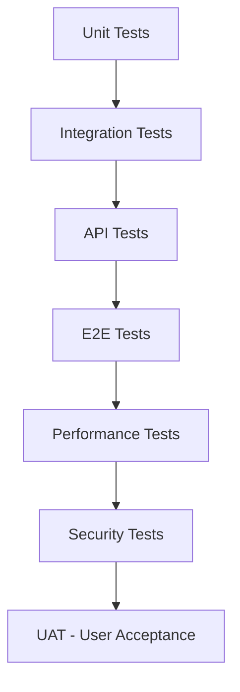

# 🧪 **خطة الاختبار الشاملة - موديول الصيانة**
## **Repair Module - Complete Testing Plan**

---

## **📅 تاريخ الإعداد: 11 أكتوبر 2025**

<br/>

```
╔════════════════════════════════════════════════════════════════════════╗
║                                                                        ║
║          🧪 خطة اختبار شاملة لموديول الصيانة المحسّن                ║
║                                                                        ║
║  ✅ Unit Tests - اختبارات الوحدات                                     ║
║  ✅ Integration Tests - اختبارات التكامل                             ║
║  ✅ E2E Tests - اختبارات شاملة (Playwright)                          ║
║  ✅ Performance Tests - اختبارات الأداء                              ║
║  ✅ Security Tests - اختبارات الأمان                                 ║
║                                                                        ║
╚════════════════════════════════════════════════════════════════════════╝
```

---

# 📋 **فهرس المحتويات**

1. [استراتيجية الاختبار](#1-استراتيجية-الاختبار)
2. [Unit Tests](#2-unit-tests)
3. [Integration Tests](#3-integration-tests)
4. [E2E Tests with Playwright](#4-e2e-tests-with-playwright)
5. [Performance Tests](#5-performance-tests)
6. [Security Tests](#6-security-tests)
7. [Negative Test Cases](#7-negative-test-cases)
8. [Test Data & Fixtures](#8-test-data--fixtures)
9. [Test Automation](#9-test-automation)
10. [Test Reports](#10-test-reports)

---

<br/>

# 🎯 **1. استراتيجية الاختبار**

## **1.1 مستويات الاختبار**



## **1.2 أهداف الاختبار**

### **✅ الأهداف الأساسية:**
```
1️⃣ ضمان عمل جميع الـ APIs بشكل صحيح
2️⃣ التأكد من التكامل السليم بين الموديولات
3️⃣ اختبار دورة العمل الكاملة end-to-end
4️⃣ قياس أداء النظام تحت أحمال مختلفة
5️⃣ اكتشاف الثغرات الأمنية والصلاحيات
6️⃣ ضمان جودة تجربة المستخدم
```

## **1.3 Test Coverage Goals**

```javascript
// أهداف تغطية الاختبارات
{
  "unitTests": {
    "target": "90%",
    "critical": ["services", "controllers", "models"]
  },
  "integrationTests": {
    "target": "85%",
    "critical": ["repair-inventory", "repair-crm", "repair-finance"]
  },
  "e2eTests": {
    "target": "80%",
    "critical": ["complete-repair-workflow", "parts-management", "invoicing"]
  }
}
```

---

<br/>

# 🔬 **2. Unit Tests**

## **2.1 Backend Services - Unit Tests**

### **📦 Parts Management Service Tests**

```javascript
/**
 * ========================================
 * ملف: tests/unit/services/partsManagementService.test.js
 * ========================================
 */

const { PartsManagementService } = require('../../../services/partsManagementService');
const { PartsUsed, InventoryItem, StockLevel } = require('../../../models');

describe('PartsManagementService', () => {
  
  describe('addPartToRepair', () => {
    
    it('should add part successfully when stock is available', async () => {
      // Arrange
      const repairId = 1;
      const partData = {
        inventoryItemId: 100,
        quantity: 2,
        warehouseId: 1,
        technicianId: 5
      };
      
      // Mock inventory item
      jest.spyOn(InventoryItem, 'findByPk').mockResolvedValue({
        id: 100,
        name: 'iPhone Screen',
        purchasePrice: 1000,
        sellingPrice: 1500
      });
      
      // Mock stock level
      jest.spyOn(StockLevel, 'findOne').mockResolvedValue({
        quantity: 10,
        warehouseId: 1
      });
      
      // Act
      const result = await PartsManagementService.addPartToRepair(repairId, partData);
      
      // Assert
      expect(result).toBeDefined();
      expect(result.status).toBe('requested');
      expect(result.totalCost).toBe(2000); // 1000 * 2
      expect(result.totalPrice).toBe(3000); // 1500 * 2
      expect(result.profit).toBe(1000); // 3000 - 2000
    });
    
    it('should throw error when stock is insufficient', async () => {
      // Arrange
      const repairId = 1;
      const partData = {
        inventoryItemId: 100,
        quantity: 10,
        warehouseId: 1
      };
      
      jest.spyOn(StockLevel, 'findOne').mockResolvedValue({
        quantity: 5, // Not enough
        warehouseId: 1
      });
      
      // Act & Assert
      await expect(
        PartsManagementService.addPartToRepair(repairId, partData)
      ).rejects.toThrow('القطعة غير متوفرة في المخزون');
    });
    
    it('should create stock alert when stock is low', async () => {
      // Arrange
      const repairId = 1;
      const partData = {
        inventoryItemId: 100,
        quantity: 8,
        warehouseId: 1
      };
      
      jest.spyOn(StockLevel, 'findOne').mockResolvedValue({
        quantity: 3, // Low stock
        minLevel: 5
      });
      
      const createAlertSpy = jest.spyOn(StockAlert, 'create').mockResolvedValue({});
      
      // Act
      try {
        await PartsManagementService.addPartToRepair(repairId, partData);
      } catch (e) {
        // Expected to fail
      }
      
      // Assert
      expect(createAlertSpy).toHaveBeenCalled();
    });
    
  });
  
  describe('confirmPartUsage', () => {
    
    it('should confirm part usage and deduct from inventory', async () => {
      // Arrange
      const partUsedId = 50;
      
      const mockPart = {
        id: 50,
        repairRequestId: 1,
        inventoryItemId: 100,
        warehouseId: 1,
        quantity: 2,
        status: 'approved',
        update: jest.fn()
      };
      
      jest.spyOn(PartsUsed, 'findByPk').mockResolvedValue(mockPart);
      
      const stockMovementSpy = jest.spyOn(StockMovement, 'create').mockResolvedValue({});
      const stockLevelSpy = jest.spyOn(StockLevel, 'update').mockResolvedValue([1]);
      
      // Act
      await PartsManagementService.confirmPartUsage(partUsedId);
      
      // Assert
      expect(mockPart.update).toHaveBeenCalledWith(
        expect.objectContaining({ status: 'used' })
      );
      expect(stockMovementSpy).toHaveBeenCalled();
      expect(stockLevelSpy).toHaveBeenCalled();
    });
    
    it('should add part to cost breakdown after confirmation', async () => {
      // Arrange
      const partUsedId = 50;
      
      const mockPart = {
        id: 50,
        repairRequestId: 1,
        inventoryItemId: 100,
        quantity: 2,
        unitPurchasePrice: 1000,
        unitSellingPrice: 1500,
        totalCost: 2000,
        totalPrice: 3000,
        profit: 1000,
        update: jest.fn()
      };
      
      jest.spyOn(PartsUsed, 'findByPk').mockResolvedValue(mockPart);
      const costBreakdownSpy = jest.spyOn(RepairCostBreakdown, 'create').mockResolvedValue({});
      
      // Act
      await PartsManagementService.confirmPartUsage(partUsedId);
      
      // Assert
      expect(costBreakdownSpy).toHaveBeenCalledWith(
        expect.objectContaining({
          repairRequestId: 1,
          itemType: 'part',
          totalCost: 2000,
          totalPrice: 3000,
          profit: 1000
        })
      );
    });
    
  });
  
  describe('returnPart', () => {
    
    it('should return part to inventory and update stock', async () => {
      // Arrange
      const partUsedId = 50;
      const returnData = { reason: 'لم يتم استخدامها' };
      
      const mockPart = {
        id: 50,
        repairRequestId: 1,
        inventoryItemId: 100,
        warehouseId: 1,
        quantity: 2,
        status: 'used',
        update: jest.fn()
      };
      
      jest.spyOn(PartsUsed, 'findByPk').mockResolvedValue(mockPart);
      const stockMovementSpy = jest.spyOn(StockMovement, 'create').mockResolvedValue({});
      const stockLevelSpy = jest.spyOn(StockLevel, 'update').mockResolvedValue([1]);
      
      // Act
      await PartsManagementService.returnPart(partUsedId, returnData);
      
      // Assert
      expect(mockPart.update).toHaveBeenCalledWith(
        expect.objectContaining({ 
          status: 'returned',
          returnReason: 'لم يتم استخدامها'
        })
      );
      expect(stockMovementSpy).toHaveBeenCalledWith(
        expect.objectContaining({ 
          movementType: 'return',
          quantity: 2
        })
      );
      expect(stockLevelSpy).toHaveBeenCalled();
    });
    
  });
  
});
```

---

### **🔄 Repair Workflow Service Tests**

```javascript
/**
 * ========================================
 * ملف: tests/unit/services/repairWorkflowService.test.js
 * ========================================
 */

const { RepairWorkflowService } = require('../../../services/repairWorkflowService');
const { RepairRequest, RepairWorkflow } = require('../../../models');

describe('RepairWorkflowService', () => {
  
  describe('advanceToNextStage', () => {
    
    it('should advance repair to diagnosis stage', async () => {
      // Arrange
      const repairId = 1;
      const stageData = {
        stage: 'initial_diagnosis',
        userId: 5,
        notes: 'تم فحص الجهاز'
      };
      
      const mockRepair = {
        id: 1,
        status: 'received',
        update: jest.fn()
      };
      
      jest.spyOn(RepairRequest, 'findByPk').mockResolvedValue(mockRepair);
      const workflowSpy = jest.spyOn(RepairWorkflow, 'create').mockResolvedValue({
        id: 10,
        stage: 'initial_diagnosis'
      });
      
      // Act
      const result = await RepairWorkflowService.advanceToNextStage(repairId, stageData);
      
      // Assert
      expect(result).toBeDefined();
      expect(workflowSpy).toHaveBeenCalledWith(
        expect.objectContaining({
          repairRequestId: repairId,
          stage: 'initial_diagnosis',
          status: 'in_progress'
        })
      );
      expect(mockRepair.update).toHaveBeenCalledWith(
        expect.objectContaining({ status: 'diagnosed' })
      );
    });
    
    it('should send notification when advancing to repair_completed', async () => {
      // Arrange
      const repairId = 1;
      const stageData = {
        stage: 'repair_completed',
        userId: 5
      };
      
      const mockRepair = {
        id: 1,
        customerId: 20,
        status: 'in_progress',
        update: jest.fn()
      };
      
      jest.spyOn(RepairRequest, 'findByPk').mockResolvedValue(mockRepair);
      const notificationSpy = jest.spyOn(NotificationService, 'send').mockResolvedValue({});
      
      // Act
      await RepairWorkflowService.advanceToNextStage(repairId, stageData);
      
      // Assert
      expect(notificationSpy).toHaveBeenCalledWith(
        expect.objectContaining({
          customerId: 20,
          type: 'repair_completed'
        })
      );
    });
    
  });
  
  describe('validateStageTransition', () => {
    
    it('should allow valid stage transition', () => {
      // Arrange
      const currentStage = 'received';
      const nextStage = 'initial_diagnosis';
      
      // Act
      const isValid = RepairWorkflowService.validateStageTransition(currentStage, nextStage);
      
      // Assert
      expect(isValid).toBe(true);
    });
    
    it('should reject invalid stage transition', () => {
      // Arrange
      const currentStage = 'received';
      const nextStage = 'delivered'; // Can't jump directly
      
      // Act
      const isValid = RepairWorkflowService.validateStageTransition(currentStage, nextStage);
      
      // Assert
      expect(isValid).toBe(false);
    });
    
  });
  
});
```

---

### **💰 Cost Calculation Tests**

```javascript
/**
 * ========================================
 * ملف: tests/unit/services/costCalculationService.test.js
 * ========================================
 */

const { CostCalculationService } = require('../../../services/costCalculationService');

describe('CostCalculationService', () => {
  
  describe('calculateRepairCost', () => {
    
    it('should calculate total cost from parts and services', async () => {
      // Arrange
      const repairId = 1;
      
      const mockParts = [
        { totalCost: 1000, totalPrice: 1500, profit: 500 },
        { totalCost: 500, totalPrice: 800, profit: 300 }
      ];
      
      const mockServices = [
        { baseCost: 200, finalPrice: 500, profit: 300 },
        { baseCost: 100, finalPrice: 300, profit: 200 }
      ];
      
      jest.spyOn(PartsUsed, 'findAll').mockResolvedValue(mockParts);
      jest.spyOn(RepairRequestService, 'findAll').mockResolvedValue(mockServices);
      
      // Act
      const result = await CostCalculationService.calculateRepairCost(repairId);
      
      // Assert
      expect(result.totalPartsCost).toBe(1500); // 1000 + 500
      expect(result.totalServicesCost).toBe(300); // 200 + 100
      expect(result.totalCost).toBe(1800);
      expect(result.totalPrice).toBe(3100); // 1500 + 800 + 500 + 300
      expect(result.totalProfit).toBe(1300); // 500 + 300 + 300 + 200
      expect(result.profitMargin).toBeCloseTo(72.22); // (1300/1800)*100
    });
    
    it('should include tax in final amount', async () => {
      // Arrange
      const repairId = 1;
      
      jest.spyOn(PartsUsed, 'findAll').mockResolvedValue([
        { totalCost: 1000, totalPrice: 1500 }
      ]);
      jest.spyOn(RepairRequestService, 'findAll').mockResolvedValue([
        { baseCost: 200, finalPrice: 500 }
      ]);
      
      // Act
      const result = await CostCalculationService.calculateRepairCost(repairId, { includeTax: true });
      
      // Assert
      const subtotal = 2000; // 1500 + 500
      const tax = subtotal * 0.14; // 14%
      expect(result.taxAmount).toBe(tax);
      expect(result.finalAmount).toBe(subtotal + tax);
    });
    
  });
  
  describe('calculateProfitMargin', () => {
    
    it('should calculate profit margin correctly', () => {
      // Arrange
      const cost = 1000;
      const price = 1500;
      
      // Act
      const margin = CostCalculationService.calculateProfitMargin(cost, price);
      
      // Assert
      expect(margin).toBe(50); // (1500-1000)/1000 * 100
    });
    
    it('should return 0 when cost is 0', () => {
      // Arrange
      const cost = 0;
      const price = 1500;
      
      // Act
      const margin = CostCalculationService.calculateProfitMargin(cost, price);
      
      // Assert
      expect(margin).toBe(0);
    });
    
  });
  
});
```

---

## **2.2 Frontend Components - Unit Tests**

### **🧩 PartsTab Component Tests**

```javascript
/**
 * ========================================
 * ملف: frontend/src/components/repair/__tests__/PartsTab.test.jsx
 * ========================================
 */

import { render, screen, fireEvent, waitFor } from '@testing-library/react';
import { PartsTab } from '../PartsTab';
import * as api from '../../../services/api';

jest.mock('../../../services/api');

describe('PartsTab Component', () => {
  
  const mockRepair = {
    id: 1,
    status: 'in_progress'
  };
  
  const mockParts = [
    {
      id: 1,
      itemName: 'iPhone Screen',
      itemSku: 'SCR-IP12',
      quantity: 1,
      unitSellingPrice: 1500,
      totalPrice: 1500,
      status: 'approved'
    }
  ];
  
  beforeEach(() => {
    jest.clearAllMocks();
  });
  
  it('should render parts list', async () => {
    // Arrange
    api.get.mockResolvedValue({ data: mockParts });
    
    // Act
    render(<PartsTab repair={mockRepair} />);
    
    // Assert
    await waitFor(() => {
      expect(screen.getByText('iPhone Screen')).toBeInTheDocument();
      expect(screen.getByText('SCR-IP12')).toBeInTheDocument();
      expect(screen.getByText('1500 جنيه')).toBeInTheDocument();
    });
  });
  
  it('should open add part modal when clicking add button', async () => {
    // Arrange
    api.get.mockResolvedValue({ data: mockParts });
    render(<PartsTab repair={mockRepair} />);
    
    // Act
    const addButton = screen.getByText(/إضافة قطعة/i);
    fireEvent.click(addButton);
    
    // Assert
    await waitFor(() => {
      expect(screen.getByText(/اختر القطعة/i)).toBeInTheDocument();
    });
  });
  
  it('should show stock warning when quantity is insufficient', async () => {
    // Arrange
    const partsWithLowStock = [{
      ...mockParts[0],
      stockLevel: { quantity: 0 }
    }];
    
    api.get.mockResolvedValue({ data: partsWithLowStock });
    render(<PartsTab repair={mockRepair} />);
    
    // Assert
    await waitFor(() => {
      expect(screen.getByText(/⚠️/)).toBeInTheDocument();
    });
  });
  
  it('should call API when confirming part usage', async () => {
    // Arrange
    api.get.mockResolvedValue({ data: mockParts });
    api.post.mockResolvedValue({ data: { success: true } });
    
    render(<PartsTab repair={mockRepair} />);
    
    await waitFor(() => {
      expect(screen.getByText('iPhone Screen')).toBeInTheDocument();
    });
    
    // Act
    const confirmButton = screen.getByText(/تأكيد/i);
    fireEvent.click(confirmButton);
    
    // Assert
    await waitFor(() => {
      expect(api.post).toHaveBeenCalledWith(
        '/parts-used/1/confirm',
        expect.anything()
      );
    });
  });
  
});
```

---

<br/>

# 🔗 **3. Integration Tests**

## **3.1 Repair + Inventory Integration**

```javascript
/**
 * ========================================
 * ملف: tests/integration/repair-inventory.test.js
 * ========================================
 */

const request = require('supertest');
const app = require('../../app');
const { sequelize, RepairRequest, PartsUsed, StockLevel, StockMovement } = require('../../models');

describe('Repair + Inventory Integration', () => {
  
  let authToken;
  let testRepair;
  let testInventoryItem;
  
  beforeAll(async () => {
    await sequelize.sync({ force: true });
    
    // Login
    const loginRes = await request(app)
      .post('/api/auth/login')
      .send({ email: 'test@test.com', password: 'password' });
    authToken = loginRes.body.token;
    
    // Create test data
    testInventoryItem = await InventoryItem.create({
      name: 'Test Part',
      sku: 'TEST-001',
      purchasePrice: 100,
      sellingPrice: 150
    });
    
    await StockLevel.create({
      inventoryItemId: testInventoryItem.id,
      warehouseId: 1,
      quantity: 10
    });
    
    testRepair = await RepairRequest.create({
      customerId: 1,
      deviceBrand: 'Apple',
      deviceModel: 'iPhone 12',
      status: 'diagnosed'
    });
  });
  
  afterAll(async () => {
    await sequelize.close();
  });
  
  describe('POST /api/repairs/:id/parts', () => {
    
    it('should add part and reserve stock', async () => {
      // Act
      const res = await request(app)
        .post(`/api/repairs/${testRepair.id}/parts`)
        .set('Authorization', `Bearer ${authToken}`)
        .send({
          inventoryItemId: testInventoryItem.id,
          quantity: 2,
          warehouseId: 1
        });
      
      // Assert
      expect(res.status).toBe(201);
      expect(res.body.success).toBe(true);
      
      // Verify part was added
      const part = await PartsUsed.findOne({
        where: { repairRequestId: testRepair.id }
      });
      expect(part).toBeDefined();
      expect(part.status).toBe('requested');
      
      // Verify stock was reserved
      const stockLevel = await StockLevel.findOne({
        where: { inventoryItemId: testInventoryItem.id }
      });
      expect(stockLevel.quantity).toBe(8); // 10 - 2
      expect(stockLevel.reservedQuantity).toBe(2);
      
      // Verify stock movement was created
      const movement = await StockMovement.findOne({
        where: { 
          inventoryItemId: testInventoryItem.id,
          movementType: 'reserved'
        }
      });
      expect(movement).toBeDefined();
      expect(movement.quantity).toBe(-2);
    });
    
    it('should fail when stock is insufficient', async () => {
      // Act
      const res = await request(app)
        .post(`/api/repairs/${testRepair.id}/parts`)
        .set('Authorization', `Bearer ${authToken}`)
        .send({
          inventoryItemId: testInventoryItem.id,
          quantity: 20, // More than available
          warehouseId: 1
        });
      
      // Assert
      expect(res.status).toBe(400);
      expect(res.body.message).toContain('غير متوفرة');
    });
    
  });
  
  describe('POST /api/parts-used/:id/confirm', () => {
    
    let testPart;
    
    beforeEach(async () => {
      testPart = await PartsUsed.create({
        repairRequestId: testRepair.id,
        inventoryItemId: testInventoryItem.id,
        quantity: 2,
        status: 'approved',
        warehouseId: 1,
        unitPurchasePrice: 100,
        unitSellingPrice: 150
      });
    });
    
    it('should confirm usage and deduct from stock', async () => {
      // Act
      const res = await request(app)
        .post(`/api/parts-used/${testPart.id}/confirm`)
        .set('Authorization', `Bearer ${authToken}`);
      
      // Assert
      expect(res.status).toBe(200);
      
      // Verify part status
      await testPart.reload();
      expect(testPart.status).toBe('used');
      expect(testPart.usedAt).toBeDefined();
      
      // Verify stock was deducted
      const stockLevel = await StockLevel.findOne({
        where: { inventoryItemId: testInventoryItem.id }
      });
      expect(stockLevel.reservedQuantity).toBe(0);
      
      // Verify usage movement
      const movement = await StockMovement.findOne({
        where: { 
          inventoryItemId: testInventoryItem.id,
          movementType: 'usage'
        },
        order: [['createdAt', 'DESC']]
      });
      expect(movement).toBeDefined();
    });
    
  });
  
  describe('POST /api/parts-used/:id/return', () => {
    
    it('should return part to stock', async () => {
      // Arrange
      const partToReturn = await PartsUsed.create({
        repairRequestId: testRepair.id,
        inventoryItemId: testInventoryItem.id,
        quantity: 1,
        status: 'used',
        warehouseId: 1
      });
      
      const initialStock = await StockLevel.findOne({
        where: { inventoryItemId: testInventoryItem.id }
      });
      
      // Act
      const res = await request(app)
        .post(`/api/parts-used/${partToReturn.id}/return`)
        .set('Authorization', `Bearer ${authToken}`)
        .send({ reason: 'غير مستخدمة' });
      
      // Assert
      expect(res.status).toBe(200);
      
      // Verify stock was returned
      const newStock = await StockLevel.findOne({
        where: { inventoryItemId: testInventoryItem.id }
      });
      expect(newStock.quantity).toBe(initialStock.quantity + 1);
      
      // Verify return movement
      const movement = await StockMovement.findOne({
        where: { 
          inventoryItemId: testInventoryItem.id,
          movementType: 'return'
        },
        order: [['createdAt', 'DESC']]
      });
      expect(movement).toBeDefined();
      expect(movement.quantity).toBe(1);
    });
    
  });
  
});
```

---

## **3.2 Repair + CRM Integration**

```javascript
/**
 * ========================================
 * ملف: tests/integration/repair-crm.test.js
 * ========================================
 */

describe('Repair + CRM Integration', () => {
  
  let testCustomer;
  
  beforeAll(async () => {
    testCustomer = await Customer.create({
      name: 'أحمد محمد',
      phone: '01012345678',
      email: 'ahmed@test.com',
      totalRepairs: 0,
      lastRepairDate: null
    });
  });
  
  it('should update customer data when creating repair', async () => {
    // Act
    const res = await request(app)
      .post('/api/repairs')
      .set('Authorization', `Bearer ${authToken}`)
      .send({
        customerId: testCustomer.id,
        deviceBrand: 'Samsung',
        deviceModel: 'Galaxy S21',
        issueDescription: 'شاشة مكسورة'
      });
    
    // Assert
    expect(res.status).toBe(201);
    
    // Verify customer was updated
    await testCustomer.reload();
    expect(testCustomer.totalRepairs).toBe(1);
    expect(testCustomer.lastRepairDate).toBeDefined();
    expect(testCustomer.status).toBe('has_active_repair');
  });
  
  it('should update customer financial data on invoice creation', async () => {
    // Arrange
    const repair = await RepairRequest.create({
      customerId: testCustomer.id,
      deviceBrand: 'Apple',
      deviceModel: 'iPhone 12',
      status: 'completed',
      totalCost: 2000
    });
    
    // Act
    const invoice = await createInvoiceFromRepair(repair.id);
    
    // Assert
    await testCustomer.reload();
    expect(testCustomer.outstandingBalance).toBe(invoice.finalAmount);
    expect(testCustomer.totalInvoices).toBe(1);
  });
  
  it('should update customer status on delivery', async () => {
    // Arrange
    const repair = await RepairRequest.create({
      customerId: testCustomer.id,
      deviceBrand: 'Apple',
      deviceModel: 'iPhone 12',
      status: 'ready_delivery'
    });
    
    // Act
    await request(app)
      .put(`/api/repairs/${repair.id}`)
      .set('Authorization', `Bearer ${authToken}`)
      .send({ status: 'delivered' });
    
    // Assert
    await testCustomer.reload();
    expect(testCustomer.status).toBe('active');
  });
  
});
```

---

## **3.3 Repair + Finance Integration**

```javascript
/**
 * ========================================
 * ملف: tests/integration/repair-finance.test.js
 * ========================================
 */

describe('Repair + Finance Integration', () => {
  
  it('should create invoice automatically when repair is completed', async () => {
    // Arrange
    const repair = await RepairRequest.create({
      customerId: 1,
      deviceBrand: 'Apple',
      deviceModel: 'iPhone 12',
      status: 'in_progress',
      totalCost: 2000
    });
    
    // Add parts
    await PartsUsed.create({
      repairRequestId: repair.id,
      inventoryItemId: 1,
      quantity: 1,
      status: 'used',
      totalPrice: 1500
    });
    
    // Add services
    await RepairRequestService.create({
      repairRequestId: repair.id,
      serviceId: 1,
      finalPrice: 500
    });
    
    // Act - Complete repair
    await request(app)
      .post(`/api/repairs-enhanced/${repair.id}/complete`)
      .set('Authorization', `Bearer ${authToken}`)
      .send({ requiresQC: false });
    
    // Assert
    const invoice = await Invoice.findOne({
      where: { repairRequestId: repair.id }
    });
    
    expect(invoice).toBeDefined();
    expect(invoice.subtotal).toBe(2000); // 1500 + 500
    expect(invoice.taxAmount).toBe(280); // 2000 * 0.14
    expect(invoice.finalAmount).toBe(2280);
    
    // Verify invoice items
    const items = await InvoiceItem.findAll({
      where: { invoiceId: invoice.id }
    });
    expect(items.length).toBe(2); // 1 part + 1 service
  });
  
  it('should link payment to invoice and repair', async () => {
    // Arrange
    const repair = await RepairRequest.create({
      customerId: 1,
      deviceBrand: 'Apple',
      deviceModel: 'iPhone 12',
      status: 'delivered'
    });
    
    const invoice = await Invoice.create({
      repairRequestId: repair.id,
      customerId: 1,
      finalAmount: 2280,
      status: 'sent'
    });
    
    // Act
    const res = await request(app)
      .post('/api/payments')
      .set('Authorization', `Bearer ${authToken}`)
      .send({
        invoiceId: invoice.id,
        amount: 2280,
        paymentMethod: 'cash'
      });
    
    // Assert
    expect(res.status).toBe(201);
    
    // Verify invoice status updated
    await invoice.reload();
    expect(invoice.status).toBe('paid');
    
    // Verify repair is closed
    await repair.reload();
    expect(repair.status).toBe('closed');
  });
  
});
```

---

<br/>

# 🎭 **4. E2E Tests with Playwright**

## **4.1 Complete Repair Workflow - Happy Path**

```javascript
/**
 * ========================================
 * ملف: tests/e2e/repair-complete-workflow.spec.js
 * ========================================
 */

const { test, expect } = require('@playwright/test');

test.describe('Complete Repair Workflow - Happy Path', () => {
  
  let repairId;
  
  test.beforeEach(async ({ page }) => {
    // Login
    await page.goto('http://localhost:3000/login');
    await page.fill('[name="email"]', 'admin@fix.zone');
    await page.fill('[name="password"]', 'admin123');
    await page.click('button[type="submit"]');
    await page.waitForURL('**/dashboard');
  });
  
  test('should complete full repair workflow from creation to delivery', async ({ page }) => {
    
    // ===== Step 1: Create Repair Request =====
    await test.step('Create new repair request', async () => {
      await page.goto('http://localhost:3000/repairs/new');
      
      // Fill customer info
      await page.fill('[name="customerName"]', 'محمد أحمد');
      await page.fill('[name="customerPhone"]', '01012345678');
      await page.fill('[name="customerEmail"]', 'mohamed@test.com');
      
      // Fill device info
      await page.selectOption('[name="deviceBrand"]', 'Apple');
      await page.fill('[name="deviceModel"]', 'iPhone 12 Pro');
      await page.selectOption('[name="deviceType"]', 'Smartphone');
      await page.fill('[name="serialNumber"]', 'ABC123XYZ');
      
      // Problem description
      await page.fill('[name="issueDescription"]', 'الشاشة مكسورة والبطارية ضعيفة');
      await page.selectOption('[name="priority"]', 'high');
      
      // Submit
      await page.click('button[type="submit"]');
      await page.waitForURL('**/repairs/**');
      
      // Extract repair ID from URL
      const url = page.url();
      repairId = url.match(/\/repairs\/(\d+)/)[1];
      
      // Verify creation
      await expect(page.locator('h1')).toContainText('تفاصيل طلب الإصلاح');
      await expect(page.locator('.status-badge')).toContainText('RECEIVED');
    });
    
    // ===== Step 2: Diagnosis =====
    await test.step('Add diagnosis and parts', async () => {
      await page.goto(`http://localhost:3000/repairs/${repairId}`);
      
      // Go to diagnosis tab
      await page.click('text=التشخيص');
      
      // Add diagnosis notes
      await page.fill('[name="diagnosticNotes"]', 'تم فحص الجهاز:\n- الشاشة: تحتاج استبدال كامل\n- البطارية: ضعيفة، تحتاج استبدال');
      await page.fill('[name="estimatedHours"]', '2');
      await page.selectOption('[name="urgency"]', 'urgent');
      
      // Add parts
      await page.click('text=إضافة قطعة');
      await page.click('[data-testid="inventory-search"]');
      await page.fill('[data-testid="inventory-search"]', 'iPhone 12 Screen');
      await page.click('text=iPhone 12 Screen Assembly');
      await page.fill('[name="quantity"]', '1');
      await page.click('button:has-text("إضافة")');
      
      // Add another part (battery)
      await page.click('text=إضافة قطعة');
      await page.fill('[data-testid="inventory-search"]', 'iPhone 12 Battery');
      await page.click('text=iPhone 12 Battery Original');
      await page.fill('[name="quantity"]', '1');
      await page.click('button:has-text("إضافة")');
      
      // Add service
      await page.click('text=إضافة خدمة');
      await page.click('text=Screen Replacement');
      await page.click('button:has-text("إضافة")');
      
      // Submit diagnosis
      await page.click('button:has-text("حفظ التشخيص")');
      await page.waitForResponse(resp => resp.url().includes('/diagnose') && resp.status() === 200);
      
      // Verify quotation was created
      await expect(page.locator('.toast')).toContainText('تم حفظ التشخيص بنجاح');
    });
    
    // ===== Step 3: Approve Parts (as Manager) =====
    await test.step('Manager approves parts', async () => {
      // Navigate to approvals page
      await page.goto('http://localhost:3000/approvals');
      
      // Find approval for this repair
      const approvalCard = page.locator(`.approval-card:has-text("iPhone 12 Pro")`).first();
      await expect(approvalCard).toBeVisible();
      
      // Approve
      await approvalCard.locator('button:has-text("موافقة")').click();
      
      // Verify approval
      await expect(page.locator('.toast')).toContainText('تمت الموافقة');
    });
    
    // ===== Step 4: Customer Approves Quotation =====
    await test.step('Customer approves quotation', async () => {
      // Normally customer would receive link via SMS/Email
      // For testing, we'll directly access quotation
      await page.goto(`http://localhost:3000/repairs/${repairId}`);
      
      // Find quotation
      const quotationId = await page.locator('[data-testid="quotation-id"]').textContent();
      
      // Simulate customer approval via API
      const response = await page.request.post(`/api/quotations/${quotationId}/approve`, {
        data: { customerResponse: 'موافق على السعر' }
      });
      expect(response.ok()).toBeTruthy();
      
      // Reload and verify
      await page.reload();
      await expect(page.locator('.status-badge')).toContainText('QUOTE_APPROVED');
    });
    
    // ===== Step 5: Start Repair =====
    await test.step('Technician starts repair', async () => {
      await page.goto(`http://localhost:3000/repairs/${repairId}`);
      
      // Click start repair
      await page.click('button:has-text("بدء الصيانة")');
      await page.waitForResponse(resp => resp.url().includes('/start') && resp.status() === 200);
      
      // Verify status
      await expect(page.locator('.status-badge')).toContainText('IN_PROGRESS');
      
      // Verify time tracking started
      await expect(page.locator('.time-tracking')).toContainText('جاري...');
    });
    
    // ===== Step 6: Confirm Parts Usage =====
    await test.step('Confirm parts usage during repair', async () => {
      await page.click('text=القطع');
      
      // Confirm each part
      const partRows = page.locator('.parts-table tbody tr');
      const count = await partRows.count();
      
      for (let i = 0; i < count; i++) {
        const row = partRows.nth(i);
        const confirmBtn = row.locator('button:has-text("تأكيد")');
        if (await confirmBtn.isVisible()) {
          await confirmBtn.click();
          await page.waitForTimeout(500);
        }
      }
      
      // Verify all parts are "used"
      await expect(page.locator('.status-badge:has-text("مستخدمة")')).toHaveCount(count);
    });
    
    // ===== Step 7: Complete Repair =====
    await test.step('Complete repair work', async () => {
      await page.click('button:has-text("إنهاء الصيانة")');
      
      // Fill completion form
      await page.fill('[name="technicianNotes"]', 'تم استبدال الشاشة والبطارية بنجاح. تم اختبار جميع الوظائف.');
      await page.check('[name="requiresQC"]');
      await page.click('button:has-text("تأكيد الإنهاء")');
      
      await page.waitForResponse(resp => resp.url().includes('/complete') && resp.status() === 200);
      
      // Verify status
      await expect(page.locator('.status-badge')).toContainText('QC_PENDING');
    });
    
    // ===== Step 8: Quality Check =====
    await test.step('Perform quality check', async () => {
      await page.click('text=الجودة');
      
      // Fill QC form
      await page.check('[name="functionalityCheck"]');
      await page.check('[name="appearanceCheck"]');
      await page.check('[name="partsQualityCheck"]');
      await page.check('[name="cleanlinessCheck"]');
      await page.check('[name="packagingCheck"]');
      await page.fill('[name="score"]', '95');
      await page.fill('[name="recommendations"]', 'الجهاز في حالة ممتازة بعد الصيانة');
      
      // Submit QC
      await page.click('button:has-text("حفظ نتائج الفحص")');
      await page.waitForResponse(resp => resp.url().includes('/quality-check') && resp.status() === 200);
      
      // Verify status changed to ready for delivery
      await page.reload();
      await expect(page.locator('.status-badge')).toContainText('READY_DELIVERY');
    });
    
    // ===== Step 9: Verify Invoice Created =====
    await test.step('Verify invoice was created', async () => {
      await page.click('text=نظرة عامة');
      
      // Check invoice link exists
      const invoiceLink = page.locator('a:has-text("عرض الفاتورة")');
      await expect(invoiceLink).toBeVisible();
      
      // Click and verify invoice
      await invoiceLink.click();
      await page.waitForURL('**/invoices/**');
      
      // Verify invoice details
      await expect(page.locator('.invoice-status')).toContainText('draft');
      await expect(page.locator('.invoice-total')).toBeVisible();
    });
    
    // ===== Step 10: Mark as Delivered =====
    await test.step('Mark repair as delivered', async () => {
      await page.goto(`http://localhost:3000/repairs/${repairId}`);
      
      await page.click('button:has-text("تم التسليم")');
      
      // Confirm delivery
      await page.click('button:has-text("تأكيد")');
      await page.waitForResponse(resp => resp.url().includes('/deliver') && resp.status() === 200);
      
      // Verify final status
      await expect(page.locator('.status-badge')).toContainText('DELIVERED');
      await expect(page.locator('.delivery-date')).toBeVisible();
    });
    
    // ===== Step 11: Customer Notification Check =====
    await test.step('Verify customer notifications were sent', async () => {
      await page.click('text=الإشعارات');
      
      // Verify multiple notifications exist
      const notifications = page.locator('.notification-item');
      await expect(notifications).toHaveCount(expect.any(Number));
      
      // Verify key notifications
      await expect(page.locator('.notification-item:has-text("تم استلام الجهاز")')).toBeVisible();
      await expect(page.locator('.notification-item:has-text("اكتمل التشخيص")')).toBeVisible();
      await expect(page.locator('.notification-item:has-text("جاهز للاستلام")')).toBeVisible();
      await expect(page.locator('.notification-item:has-text("تم التسليم")')).toBeVisible();
    });
    
    // ===== Step 12: Verify Cost Breakdown =====
    await test.step('Verify cost breakdown and profit', async () => {
      await page.click('text=التكاليف');
      
      // Verify summary cards
      await expect(page.locator('.cost-card:has-text("التكلفة الإجمالية")')).toBeVisible();
      await expect(page.locator('.cost-card:has-text("السعر الإجمالي")')).toBeVisible();
      await expect(page.locator('.cost-card:has-text("الربح المتوقع")')).toBeVisible();
      await expect(page.locator('.cost-card:has-text("هامش الربح")')).toBeVisible();
      
      // Verify breakdown table has entries
      const breakdownRows = page.locator('.breakdown-table tbody tr');
      await expect(breakdownRows).toHaveCount(expect.any(Number));
    });
    
  });
  
});
```

---

## **4.2 Negative Scenarios - E2E Tests**

```javascript
/**
 * ========================================
 * ملف: tests/e2e/repair-negative-scenarios.spec.js
 * ========================================
 */

test.describe('Repair Module - Negative Scenarios', () => {
  
  test('should prevent adding part when stock is insufficient', async ({ page }) => {
    await page.goto(`http://localhost:3000/repairs/1`);
    
    await page.click('text=القطع');
    await page.click('text=إضافة قطعة');
    
    // Select a part with 0 stock
    await page.fill('[data-testid="inventory-search"]', 'Out of Stock Part');
    await page.click('text=Out of Stock Part');
    await page.fill('[name="quantity"]', '1');
    
    // Should show warning
    await expect(page.locator('.alert-warning')).toContainText('⚠️ الكمية المتوفرة: 0');
    
    // Add button should be disabled
    await expect(page.locator('button:has-text("إضافة القطعة")')).toBeDisabled();
  });
  
  test('should prevent non-authorized user from approving parts', async ({ page }) => {
    // Login as technician (not manager)
    await page.goto('http://localhost:3000/login');
    await page.fill('[name="email"]', 'tech@fix.zone');
    await page.fill('[name="password"]', 'tech123');
    await page.click('button[type="submit"]');
    
    // Try to access approvals page
    await page.goto('http://localhost:3000/approvals');
    
    // Should redirect or show error
    await expect(page).toHaveURL('**/dashboard');
    await expect(page.locator('.toast-error')).toContainText('ليس لديك صلاحية');
  });
  
  test('should prevent completing repair without confirming parts', async ({ page }) => {
    await page.goto(`http://localhost:3000/repairs/1`);
    
    // Try to complete without confirming parts
    await page.click('button:has-text("إنهاء الصيانة")');
    
    // Should show error
    await expect(page.locator('.alert-error')).toContainText('يجب تأكيد جميع القطع');
  });
  
  test('should handle failed payment gracefully', async ({ page }) => {
    await page.goto(`http://localhost:3000/invoices/1`);
    
    await page.click('button:has-text("تسجيل دفعة")');
    
    // Fill invalid payment
    await page.fill('[name="amount"]', '-100'); // Negative amount
    await page.click('button:has-text("حفظ")');
    
    // Should show validation error
    await expect(page.locator('.error-message')).toContainText('المبلغ غير صالح');
  });
  
});
```

---

يتبع في ملف منفصل:
- Performance Tests
- Security Tests  
- Test Data & Fixtures
- Test Automation CI/CD
