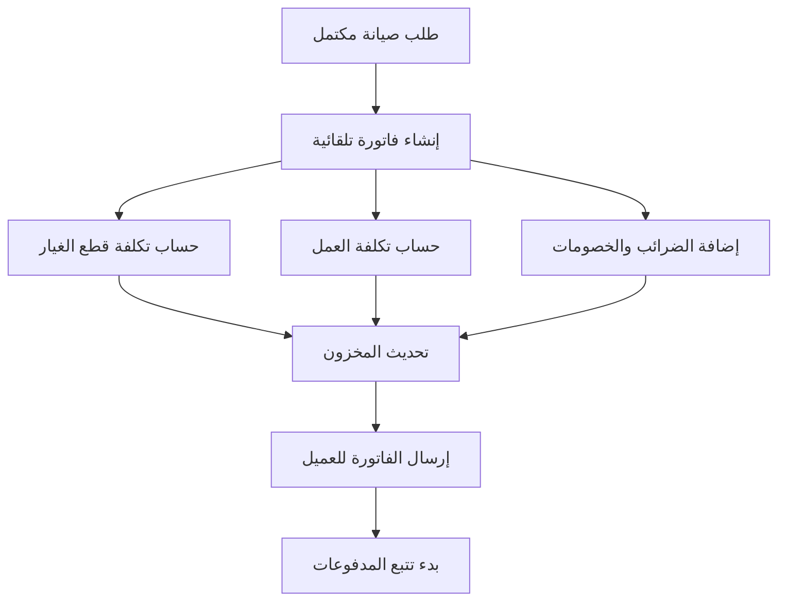
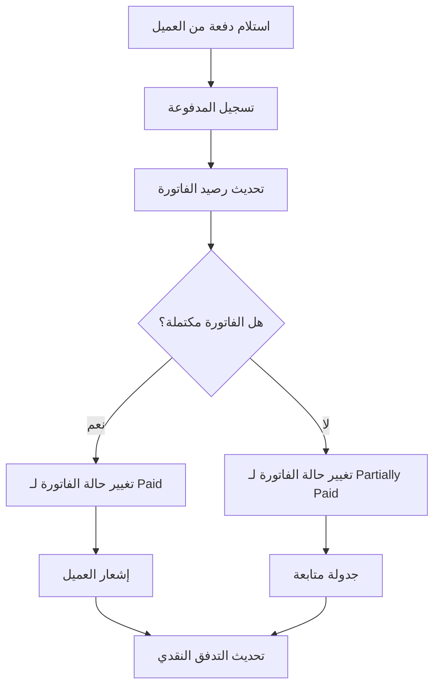
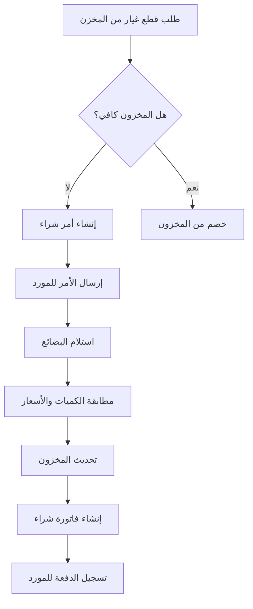

# 🔗 Matrix التكامل المالي التفصيلي - نظام FixZone ERP

## 📊 جدول التدفقات المالية الرئيسية

| العملية المالية | من → إلى | الموديولات المرتبطة | البيانات المتداخلة | API Endpoints | الوضع الحالي | الأولوية |
|------------------|-----------|---------------------|-------------------|---------------|---------------|----------|
| **إنشاء فاتورة صيانة** | Repair → Finance | Repairs, Finance, CRM, Inventory | RepairID, CustomerID, InvoiceID, Items[], StockMovement[] | `POST /api/invoices/create-from-repair/:repairId` | ✅ موجود | 🔥 عالي |
| **دفع العميل** | CRM → Finance | CRM, Finance, Repairs | CustomerID, InvoiceID, PaymentID, Amount, Method | `POST /api/payments` | ✅ موجود | 🔥 عالي |
| **شراء قطع غيار** | Vendors → Finance | Vendors, Finance, Inventory | VendorID, PurchaseOrderID, Items[], StockUpdate[] | `POST /api/purchase-orders` | ✅ موجود | 🔥 عالي |
| **استلام البضائع** | Inventory → Finance | Inventory, Vendors, Finance | PurchaseOrderID, StockMovementID, CostUpdate | `POST /api/purchase-orders/:id/receive` | ✅ موجود | 🔥 عالي |
| **استخدام قطعة في صيانة** | Inventory → Finance | Inventory, Repairs, Finance | PartID, RepairID, InvoiceItemID, CostRecord | `POST /api/parts-used` | ⚠️ جزئي | 🔥 عالي |
| **دفع أجر فني** | Finance → HR | Finance, Technicians, Repairs | TechnicianID, RepairID, PayrollRecord, Hours | `POST /api/payroll` | ❌ غير موجود | 🟡 متوسط |
| **تسجيل مصروف تشغيلي** | Finance → Reports | Finance, Reports | ExpenseID, CategoryID, Amount, Date, Receipt | `POST /api/expenses` | ✅ موجود | 🟡 متوسط |
| **حساب تكلفة الصيانة** | Repairs → Finance | Repairs, Finance, Inventory, HR | RepairID, PartsCost, LaborCost, TotalCost, Profit | `GET /api/finance/cost-analysis/:repairId` | ❌ غير موجود | 🔥 عالي |
| **توليد تقرير مالي** | Finance → Reports | Finance, Reports, All Modules | Period, Revenue, Expenses, Profit, Charts | `GET /api/finance/reports/pl` | ❌ غير موجود | 🟡 متوسط |
| **تنبيه مدفوعات متأخرة** | Finance → Notifications | Finance, CRM, Notifications | CustomerID, InvoiceID, DueDate, OverdueAmount | `GET /api/finance/overdue-payments` | ⚠️ جزئي | 🔥 عالي |

---

## 💰 تفاصيل التدفقات المالية

### **1. تدفق إنشاء الفاتورة**



**البيانات المطلوبة:**
```javascript
{
  "repairRequestId": 123,
  "customerId": 456,
  "items": [
    {
      "type": "part",
      "inventoryItemId": 789,
      "quantity": 2,
      "unitPrice": 150,
      "totalPrice": 300
    },
    {
      "type": "service",
      "serviceId": 101,
      "quantity": 1,
      "unitPrice": 200,
      "totalPrice": 200
    }
  ],
  "taxes": [
    {
      "taxType": "vat",
      "rate": 14,
      "amount": 70
    }
  ],
  "discount": {
    "type": "percentage",
    "value": 5,
    "amount": 25
  }
}
```

### **2. تدفق معالجة المدفوعات**



**البيانات المطلوبة:**
```javascript
{
  "invoiceId": 123,
  "amount": 500,
  "paymentMethod": "bank_transfer",
  "paymentDate": "2025-01-15",
  "referenceNumber": "TXN123456",
  "notes": "دفعة جزئية",
  "createdBy": 1
}
```

### **3. تدفق المشتريات والموردين**



**البيانات المطلوبة:**
```javascript
{
  "vendorId": 456,
  "items": [
    {
      "inventoryItemId": 789,
      "quantity": 10,
      "unitPrice": 120,
      "totalPrice": 1200
    }
  ],
  "expectedDelivery": "2025-01-20",
  "notes": "طلب عاجل"
}
```

---

## 🔄 APIs المطلوبة للتكامل

### **APIs موجودة حالياً:**
```javascript
// الفواتير
GET    /api/invoices                    // قائمة الفواتير
POST   /api/invoices                    // إنشاء فاتورة
GET    /api/invoices/:id                // تفاصيل فاتورة
PUT    /api/invoices/:id                // تحديث فاتورة
DELETE /api/invoices/:id                // حذف فاتورة
GET    /api/invoices/by-repair/:repairId // فاتورة طلب الإصلاح

// المدفوعات
GET    /api/payments                    // قائمة المدفوعات
POST   /api/payments                    // إضافة مدفوعة
GET    /api/payments/:id                // تفاصيل مدفوعة
PUT    /api/payments/:id                // تحديث مدفوعة
DELETE /api/payments/:id                // حذف مدفوعة

// الموردين
GET    /api/vendors                     // قائمة الموردين
POST   /api/vendors                     // إضافة مورد
GET    /api/vendors/:id                 // تفاصيل مورد
PUT    /api/vendors/:id                 // تحديث مورد
DELETE /api/vendors/:id                 // حذف مورد

// المصروفات
GET    /api/expenses                    // قائمة المصروفات
POST   /api/expenses                    // إضافة مصروف
GET    /api/expenses/:id                // تفاصيل مصروف
PUT    /api/expenses/:id                // تحديث مصروف
DELETE /api/expenses/:id                // حذف مصروف
```

### **APIs مطلوبة للتطوير:**

#### **1. تكامل الصيانة مع المالية:**
```javascript
// حساب تكلفة الصيانة
GET    /api/finance/cost-analysis/:repairId     // تحليل تكلفة صيانة
POST   /api/finance/cost-analysis/calculate     // حساب تكلفة جديدة
GET    /api/finance/cost-analysis/summary       // ملخص التكاليف

// ربط قطع الغيار بالتكلفة
POST   /api/parts-used                         // تسجيل استخدام قطعة
GET    /api/parts-used/repair/:repairId        // قطع مستخدمة في صيانة
PUT    /api/parts-used/:id                     // تحديث استخدام قطعة
DELETE /api/parts-used/:id                     // حذف استخدام قطعة
```

#### **2. التقارير المالية:**
```javascript
// التقارير الأساسية
GET    /api/finance/reports/pl                 // تقرير الأرباح والخسائر
GET    /api/finance/reports/cashflow           // تقرير التدفق النقدي
GET    /api/finance/reports/balance-sheet      // الميزانية العمومية

// تقارير تحليلية
GET    /api/finance/reports/profitability      // تحليل الربحية
GET    /api/finance/reports/customer-analysis  // تحليل العملاء
GET    /api/finance/reports/vendor-analysis    // تحليل الموردين
GET    /api/finance/reports/service-analysis   // تحليل الخدمات
```

#### **3. نظام الضرائب:**
```javascript
// إدارة الضرائب
GET    /api/finance/tax/config                 // إعدادات الضرائب
POST   /api/finance/tax/config                 // إضافة ضريبة جديدة
PUT    /api/finance/tax/config/:id             // تحديث ضريبة
GET    /api/finance/tax/reports                // تقارير الضرائب
POST   /api/finance/tax/calculate              // حساب الضرائب
```

#### **4. نظام المحاسبة المزدوج:**
```javascript
// دليل الحسابات
GET    /api/finance/chart-of-accounts          // قائمة الحسابات
POST   /api/finance/chart-of-accounts          // إضافة حساب جديد
PUT    /api/finance/chart-of-accounts/:id      // تحديث حساب

// القيود اليومية
GET    /api/finance/journal-entries            // قائمة القيود
POST   /api/finance/journal-entries            // إنشاء قيد يومي
GET    /api/finance/journal-entries/:id        // تفاصيل قيد
POST   /api/finance/journal-entries/:id/post   // ترحيل قيد
```

#### **5. التنبيهات والإشعارات:**
```javascript
// المدفوعات المتأخرة
GET    /api/finance/overdue-payments           // قائمة المدفوعات المتأخرة
POST   /api/finance/overdue-payments/send-alerts // إرسال تنبيهات
GET    /api/finance/overdue-payments/stats     // إحصائيات المتأخرات

// تنبيهات مالية
GET    /api/finance/alerts                     // التنبيهات المالية
POST   /api/finance/alerts                     // إنشاء تنبيه جديد
PUT    /api/finance/alerts/:id                 // تحديث تنبيه
DELETE /api/finance/alerts/:id                 // حذف تنبيه
```

---

## 🗄️ الجداول المطلوبة للتكامل

### **1. جدول تكلفة الصيانة:**
```sql
CREATE TABLE RepairCostAnalysis (
  id INT PRIMARY KEY AUTO_INCREMENT,
  repairRequestId INT NOT NULL,
  partsCost DECIMAL(10,2) DEFAULT 0,
  laborCost DECIMAL(10,2) DEFAULT 0,
  materialCost DECIMAL(10,2) DEFAULT 0,
  overheadCost DECIMAL(10,2) DEFAULT 0,
  totalCost DECIMAL(10,2) NOT NULL,
  sellingPrice DECIMAL(10,2) NOT NULL,
  profit DECIMAL(10,2) NOT NULL,
  profitMargin DECIMAL(5,2) NOT NULL,
  calculatedAt TIMESTAMP DEFAULT CURRENT_TIMESTAMP,
  calculatedBy INT,
  FOREIGN KEY (repairRequestId) REFERENCES RepairRequest(id),
  FOREIGN KEY (calculatedBy) REFERENCES User(id)
);
```

### **2. جدول تكلفة قطع الغيار:**
```sql
CREATE TABLE PartsCostRecord (
  id INT PRIMARY KEY AUTO_INCREMENT,
  partsUsedId INT NOT NULL,
  purchaseCost DECIMAL(10,2) NOT NULL,
  sellingPrice DECIMAL(10,2) NOT NULL,
  profit DECIMAL(10,2) NOT NULL,
  profitMargin DECIMAL(5,2) NOT NULL,
  recordedAt TIMESTAMP DEFAULT CURRENT_TIMESTAMP,
  FOREIGN KEY (partsUsedId) REFERENCES PartsUsed(id)
);
```

### **3. جدول تكلفة العمل:**
```sql
CREATE TABLE LaborCostRecord (
  id INT PRIMARY KEY AUTO_INCREMENT,
  repairRequestId INT NOT NULL,
  technicianId INT NOT NULL,
  hoursWorked DECIMAL(4,2) NOT NULL,
  hourlyRate DECIMAL(10,2) NOT NULL,
  totalCost DECIMAL(10,2) NOT NULL,
  recordedAt TIMESTAMP DEFAULT CURRENT_TIMESTAMP,
  FOREIGN KEY (repairRequestId) REFERENCES RepairRequest(id),
  FOREIGN KEY (technicianId) REFERENCES User(id)
);
```

### **4. جدول التنبيهات المالية:**
```sql
CREATE TABLE FinancialAlert (
  id INT PRIMARY KEY AUTO_INCREMENT,
  alertType ENUM('overdue_payment', 'low_stock', 'budget_exceeded', 'invoice_overdue') NOT NULL,
  title VARCHAR(255) NOT NULL,
  message TEXT NOT NULL,
  referenceType VARCHAR(50), -- 'invoice', 'payment', 'expense'
  referenceId INT,
  severity ENUM('low', 'medium', 'high', 'critical') DEFAULT 'medium',
  isRead BOOLEAN DEFAULT FALSE,
  isResolved BOOLEAN DEFAULT FALSE,
  createdBy INT,
  createdAt TIMESTAMP DEFAULT CURRENT_TIMESTAMP,
  resolvedAt TIMESTAMP NULL,
  FOREIGN KEY (createdBy) REFERENCES User(id)
);
```

### **5. جدول إعدادات الضرائب:**
```sql
CREATE TABLE TaxConfiguration (
  id INT PRIMARY KEY AUTO_INCREMENT,
  taxName VARCHAR(100) NOT NULL,
  taxRate DECIMAL(5,2) NOT NULL,
  taxType ENUM('vat', 'income', 'withholding', 'other') NOT NULL,
  isActive BOOLEAN DEFAULT TRUE,
  applicableTo ENUM('all', 'services', 'parts', 'custom') DEFAULT 'all',
  customRules JSON, -- قواعد مخصصة للضرائب
  effectiveFrom DATE NOT NULL,
  effectiveTo DATE NULL,
  createdAt TIMESTAMP DEFAULT CURRENT_TIMESTAMP,
  createdBy INT,
  FOREIGN KEY (createdBy) REFERENCES User(id)
);
```

---

## 📊 مؤشرات الأداء للتكامل

### **1. مؤشرات مالية:**
- **معدل تحصيل المدفوعات:** نسبة المدفوعات المحصلة من إجمالي الفواتير
- **متوسط وقت التحصيل:** عدد الأيام من إنشاء الفاتورة حتى التحصيل الكامل
- **نسبة المدفوعات المتأخرة:** نسبة الفواتير المتأخرة عن موعد الاستحقاق
- **هامش الربح الإجمالي:** نسبة الربح من إجمالي المبيعات
- **تكلفة كل عملية صيانة:** متوسط التكلفة لكل طلب إصلاح

### **2. مؤشرات تشغيلية:**
- **دقة البيانات المالية:** نسبة البيانات الصحيحة من إجمالي البيانات
- **وقت معالجة الفواتير:** متوسط الوقت من إنشاء الفاتورة حتى إرسالها
- **معدل الأخطاء المالية:** عدد الأخطاء في العمليات المالية
- **رضا العملاء عن الخدمة المالية:** تقييم العملاء للخدمات المالية

### **3. مؤشرات التكامل:**
- **معدل التكامل بين الموديولات:** نسبة العمليات المتكاملة بنجاح
- **وقت استجابة APIs:** متوسط وقت استجابة APIs المالية
- **موثوقية النظام:** نسبة الوقت الذي يعمل فيه النظام بدون أخطاء

---

## 🔧 خطة التنفيذ التقني

### **المرحلة الأولى (أسبوع 1-2):**
1. **تحسين ربط الفواتير بالمخزون**
   - تعديل `InvoiceController` لربط تلقائي مع `StockMovement`
   - إضافة APIs لحساب تكلفة قطع الغيار
   - تطوير نظام تتبع الربح لكل عملية صيانة

2. **تحسين نظام المدفوعات**
   - ربط مباشر بين المدفوعات والعملاء
   - إضافة نظام التنبيهات للمدفوعات المتأخرة
   - تحسين واجهة إضافة المدفوعات

### **المرحلة الثانية (أسبوع 3-4):**
1. **تطوير نظام تكلفة الصيانة**
   - إنشاء `RepairCostAnalysis` table
   - تطوير APIs لحساب تكلفة الصيانة
   - ربط تكلفة العمل مع ساعات الفني

2. **تطوير التقارير الأساسية**
   - تقرير الأرباح والخسائر
   - تقرير المبيعات الشهرية
   - تقرير العملاء الأكثر تأخيراً

### **المرحلة الثالثة (أسبوع 5-6):**
1. **نظام الضرائب المتقدم**
   - إنشاء `TaxConfiguration` table
   - تطوير نظام حساب الضرائب
   - تقارير الضرائب الشهرية

2. **نظام المصروفات المتقدم**
   - تحسين تصنيف المصروفات
   - ربط المصروفات بالمشاريع
   - نظام الموافقات للمصروفات الكبيرة

---

## 📋 قائمة المهام التقنية

### **Backend Tasks:**
- [ ] إنشاء `RepairCostAnalysisController`
- [ ] تطوير `TaxCalculationService`
- [ ] إنشاء `FinancialReportService`
- [ ] تطوير `AlertService` للتنبيهات المالية
- [ ] إنشاء `CostAnalysisService`
- [ ] تطوير `PaymentNotificationService`

### **Database Tasks:**
- [ ] إنشاء جدول `RepairCostAnalysis`
- [ ] إنشاء جدول `PartsCostRecord`
- [ ] إنشاء جدول `LaborCostRecord`
- [ ] إنشاء جدول `FinancialAlert`
- [ ] إنشاء جدول `TaxConfiguration`
- [ ] إضافة فهارس للأداء

### **Frontend Tasks:**
- [ ] تطوير `CostAnalysisPage`
- [ ] إنشاء `FinancialReportsPage`
- [ ] تطوير `TaxManagementPage`
- [ ] إنشاء `AlertDashboard`
- [ ] تطوير `ProfitabilityAnalysisPage`
- [ ] إنشاء `PaymentTrackingPage`

### **Integration Tasks:**
- [ ] ربط الفواتير بالمخزون
- [ ] ربط المدفوعات بالعملاء
- [ ] ربط تكلفة الصيانة بالقطع المستخدمة
- [ ] ربط المصروفات بالفروع
- [ ] ربط التقارير بجميع الموديولات

---

*هذا Matrix التكامل يوضح العلاقات التفصيلية بين جميع الموديولات المالية ويحدد الخطوات التقنية المطلوبة لتحقيق التكامل الكامل.*
